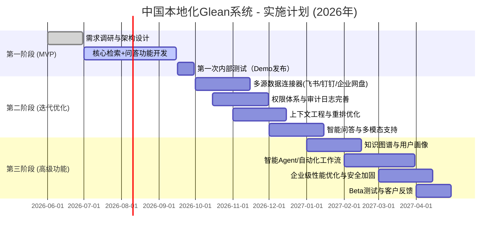

# 执行摘要

本文针对中国市场设计一款本地化的 AI 原生企业知识系统（类似于 Glean），提供全面的市场分析、产品设计与技术方案建议。重点包括目标用户画像与细分市场、主要使用场景与流程、用户痛点剖析、功能优先级和技术可行性（RAG、数据接入、权限索引、知识图谱、上下文工程、向量库与 LLM 等）、产品价值与差异化优势、竞争壁垒、渠道与合作伙伴策略（如企业直销、ISV、飞书/钉钉/企微 等平台集成）、定价模式、合规要求（数据安全法、隐私保护等）、实施路线图与 MVP 范围、工程资源预算、风险及对策、关键指标等。  

**核心结论**：尽管 Glean 代表了最先进的企业 AI 知识管理产品，但中国市场存在明确的政策与场景差异。在本地化设计中，我们将以“连接本地化生态、兼顾合规与可部署”为原则，通过强大的应用连接器、权限感知检索、知识图谱和 Agent 能力构建差异化竞争力。产品将分阶段迭代：首先实现多源文档接入与语义检索（MVP），随后增强上下文推理、Agent 自动化能力和纵深行业适配。本文给出详细的商业画布和功能架构，并附上重点用例流程、技术设计及实现建议。  

# 一、目标市场与用户

## 1. 目标用户与用户画像

- **企业管理者 / 知识负责人**：关注组织知识资产管理效率，需求标准化的知识治理、审计合规、ROI 评估等。  
- **业务部门员工（销售、客服、研发等）**：日常需要快速获取部门内外知识（文档、项目经验、客户案例等），提高工作效率。  
- **新员工或跨部门协作人员**：面对信息孤岛，需要低门槛的知识问答和学习助手，缩短培训周期。【36†L49-L57】  
- **决策者 / 高管**：需要将大量报告、数据和市场情报整理成洞察，以应对突发事件和战略规划。  

用户画像示例：新加入项目组的程序员小张，希望通过自然语言查询项目文档和经验沉淀文档，迅速定位解决方案；供应链总监李经理，希望对仓储事故应对方案进行快速检索并获取报告摘要；IT 部门沈主管，需要将多个系统（CRM、OA、Wiki 等）中的数据汇总，为全公司提供统一的知识搜索入口。

## 2. 市场规模与细分

企业级知识管理和搜索系统正迎来爆发式增长。报告显示欧美市场已有近半大型企业部署了 AI 检索/内容系统【4†L348-L356】；中国市场在**制造、政务、金融**等行业需求最为迫切【4†L360-L370】。以制造业为例，设备运维知识库在提升效率上带来明显ROI（如蓝凌帮助企业将维修查询时间缩短70%）。政务与国企采购国产化率超60%，政策驱动强劲【4†L362-L370】。同时，中小企业对轻量化、低成本解决方案兴趣浓厚【4†L378-L382】。按用户规模划分，可分为：超大型国企/政府（需深度定制化、私有化部署）、大型跨国/国资企业（混合云部署）、中小企业（公有云或SaaS部署）。

根据行业维度，**制造业、金融业、政府部门**等是首批重点目标，因其知识密集度高、合规要求严。其次可拓展至互联网、零售和教育等需要知识协同的行业。细分市场策略中，可优先聚焦已经有明确知识管理需求的行业场景，再横向扩张至其他场景。

# 二、主要场景与流程

## 1. 典型应用场景

1. **统一搜索问答**：员工在一个界面（Web端/IM插件等）输入自然语言查询，例如“上月供应链延误的原因”，系统自动从合同、邮件、仓储报告等多源文档中检索并以回答形式返回，附带来源引用【36†L68-L72】。  
2. **新员工入职培训**：新员工通过对话形式向系统提问，例如“公司的报销流程是什么？”系统根据制度文档和培训资料进行语义检索，同时提供步骤总结和相关注意事项，引用官方文件【36†L68-L72】。  
3. **知识梳理与总结**：知识管理人员需要对大量会议记录、报告等资料进行归纳，系统自动生成主题思维导图或要点总结，辅助用户快速了解核心信息。  
4. **跨部门协同**：项目团队成员通过系统共享知识资产，添加标签、评论和FAQ，形成部门/项目的知识社区；同事提问时系统可以从社区沉淀内容中实时检索答案，促进隐性知识显性化【28†L35-L43】。  
5. **智能 Agent 办公**：高级场景下，用户可配置自动化任务（如定期汇总市场情报、整理销售周报、发布定向提醒等），系统作为智能代理主动完成任务，实现知识检索到行动的闭环【4†L348-L356】【20†L287-L294】。  

## 2. 用户工作流示例

以“项目会议知识检索”场景为例，工作流如下：  
- 用户在聊天界面/搜索框中提交问题。  
- 后端 **检索服务** 使用用户身份查询向量库，在用户有权限的知识库中召回相关文档切片（结合语义向量搜索和关键词过滤）。  
- **重排模块** 对召回内容根据相关度和多样性重新排序，进行上下文选片（Context Packing），生成超过效文段【6†L31-L39】【18†L82-L90】。  
- **LLM 引擎** 将用户问题与拼接的上下文共同输入，生成回答内容，并在答案中标注引用出处【26†L60-L63】【36†L68-L72】。  
- **知识图谱/用户画像** 层面可以为答案补充额外提示，如“此答案来自产品文档，由李工最近更新”以增加信任。  
- **后处理**：审计日志记录问题、答案及命中文档编号，供安全审查；若启用了智能 Agent，系统可基于回答触发后续任务（如发送邮件、创建Trello卡片等）。  

# 三、用户痛点与产品价值

## 1. 企业级痛点

在调研众多企业使用场景后，可归纳核心痛点【36†L49-L57】：  

- **信息孤岛**：部门和项目产生的文档、邮件、代码等知识分散存储，缺乏统一平台，导致内容隔绝、重复开发、知识流失。  
- **检索效率低**：传统关键字搜索常常无法理解意图，搜不到相关信息，尤其对于新员工或跨部门查询尤为难用【36†L49-L57】。  
- **知识更新滞后**：业务规则、产品文档动态变化，但人工录入和审核耗时，容易出现使用旧版信息而导致错误。  
- **新人培训周期长**：新员工难以快速熟悉内部知识体系，多依赖人工辅导或大量文档自学，培训成本高昂。  
- **决策支持缺失**：管理层需要从大量零散报告中梳理洞察，单靠人工整理耗时过久，难以应对突发情况【36†L49-L57】。  

以上痛点在中国市场尤为明显：国产大模型部署时效要求严格（需私有化部署）、权限隔离严格（国企数据敏感）、现有知识管理投入不足，人工解决方式占比高。

## 2. 产品价值主张

针对上述痛点，本系统具有以下核心价值：  

- **跨系统多源知识整合**：通过开箱即用的连接器（Feishu、钉钉、企微、企业网盘、文档管理系统等），将企业所有文档、邮件、表单、聊天等内容采集入库【18†L82-L90】【32†L50-L53】。员工可以在一个统一界面进行搜索和问答，无需切换多个系统，大大降低信息孤岛。  
- **语义检索与回答生成**：采用大模型+RAG技术，支持自然语言检索和对话式问答【36†L68-L72】。系统不只是返回文档链接，而是直接给出答案摘要并附引用段落，用户“一次提问，逐步深入”查询体验，显著提高检索效率【36†L68-L72】。  
- **可信度与可追溯**：回答中精确标注来源文档和段落，并提供文档历史版本追溯（Knowledge Provenance）功能【36†L74-L77】。支持行业审计需求，确保关键决策和答案均可审计回溯。  
- **主动推送与智能推荐**：基于用户角色和行为分析，系统可主动推送相关知识（例如新政策更新、项目知识分享），形成智能知识运营闭环【36†L61-L67】【20†L285-L294】。  
- **多模态与多轮交互**：除文字检索外，支持语音/图片输入，满足会议录音整理、截图问答等需求。同时支持上下文关联的多轮对话，提供连贯交互体验【26†L127-L134】【36†L68-L72】。  
- **工作流自动化（Agent）**：通过Planner/Executor层，可根据预定义或即时需求自动化常见任务，如汇报总结、表单填写、跨部门协作发起等，使系统从被动检索逐步演进为主动服务【4†L355-L363】【20†L301-L309】。  

以上功能将在**数据安全与权限合规**前提下输出成果，保护企业敏感内容【18†L80-L90】【26†L60-L63】。总之，本产品帮助企业构建“找到–理解–应用”闭环知识引擎【4†L342-L344】，将知识管理从传统存储工具升级为面向“组织智能”的核心资产。

# 四、功能优先级与技术分析

## 1. 功能规划与优先级

我们按照“MVP（首批核心交付）→6-12个月迭代”划分功能模块：  

- **MVP（0-3月）**：  
  - **文档数据接入**：支持对接常见企业知识源（文件共享、企业网盘、内部Wiki、Feishu/钉钉文档等），实现自动爬取和解析。  
  - **基础检索与问答**：基于检索增强生成（RAG）方案，实现自然语言查询和文档问答，返回语义匹配的答案和原文引用【36†L68-L72】。  
  - **权限管理**：实现按企业用户、角色的基本权限过滤，确保用户仅能查询授权内容【18†L85-L90】【36†L74-L77】。  
  - **审计日志**：记录用户查询与系统回答用于合规审查。  

- **下一阶段迭代（3-12月）**：  
  1. **多模态支持**：增加对语音、图片文件解析以及视频转写等能力。  
  2. **知识图谱构建**：对抽取的实体（人员、项目、产品等）进行关联建模，支持可视化知识图谱展示和增强检索。  
  3. **精细权限与审批**：实现文档细粒度和数据标签权限，支持管理员定义共享策略。  
  4. **智能推荐与推送**：构建用户画像，根据上下文与业务场景主动推荐相关知识或执行小任务。  
  5. **Agent 组件**：引入 Planner/Executor，提供工作流自动化，例如自动生成报告、调度任务、多轮复合查询等【20†L301-L309】。  
  6. **多语言/跨语言**（可选）：支持中文外，还可兼顾多语种环境中的企业用户需求。  

各阶段功能将依赖相应的数据量和用户反馈迭代优化，如语料标注、检索规则调整等。

## 2. 技术架构与实现要点

整个系统技术链路涵盖：**数据接入→解析→向量化→索引检索→推理生成→应用层**。示意架构：  

```mermaid
graph LR
  subgraph 数据接入层
    A[各类知识源] --> B[数据采集&解析]
  end
  subgraph 存储层
    B --> C[(向量数据库Milvus/FAISS)]
    B --> D[(文档/元数据数据库 Postgres/ES)]
  end
  subgraph 检索层
    E[查询接口] --> F[Query Rewriter]
    F --> G[检索引擎(VKV)]
    G --> H[重排器(Reranker)]
    H --> I[Context Packager]
  end
  subgraph 推理层
    I --> J[LLM 服务(Gemini3/ChatGLM)]
    J --> K[答案生成与引用]
  end
  subgraph 应用层
    K --> L[前端UI/IM插件]
    K --> M[Audit/Logging]
    M --> D
  end
  subgraph 智能Agent层
    L --> N[Agent 调度器/Planner]
    N --> O[Executor/Workflow]
  end
```

- **数据接入与解析**：支持对接 Feishu、钉钉、企微、文件服务器、内部Wikis、邮件系统等，并进行文档格式统一解析（PDF、Word、Markdown、PPT、视频转写文本等）。采用语义切分技术（基于章节、段落、句子）生成知识切片（Chunk）【18†L82-L90】【36†L61-L67】。  
- **嵌入与索引**：使用中文+中英混合语料预训练的嵌入模型（如百度文心 Embedding、E5、Nomic 等）将切片向量化【26†L127-L134】。向量与元数据一起存入向量数据库（Milvus、Weaviate 等）进行密集检索，同时建立倒排索引用于关键词召回。元数据包括文档ID、创建/更新时间、作者、所属项目/部门等。  
- **检索与选片**：检索模块结合稀疏和稠密召回，得到候选切片后通过 cross-encoder 或 MMR 重排算法综合评估相关性与多样性【6†L49-L57】。然后执行上下文装填（Context Packing）：在长度限制下优选多个文档的语义相关段落，作为 LLM 输入依据【20†L231-L239】【26†L127-L134】。  
- **权限感知**：在检索阶段加入权限过滤，确保仅返回用户有权查看的内容【18†L82-L90】。可采用向量库的 metadata 过滤或在应用层二次筛选。必要时，对高敏感度信息（如身份证号、合同条款）执行屏蔽或脱敏处理。  
- **LLM 推理**：选择具备大上下文能力的模型（如百度文言一心、ChatGLM3、Qwen 2.5 等）部署在企业私有云或本地服务器。推理时将用户查询与选片上下文拼接，输出回答文本。在答案生成中尽量引导模型使用给定文档信息，并附带出处标记【36†L68-L72】【26†L127-L134】。  
- **知识图谱**（可选）：通过抽取文档中的实体和关系构建知识图谱（如人-组织-项目），辅助理解知识间关联。图谱节点可用于增强检索（查询时联想相关实体）。如 Glean 的“知识图谱”将内容、人员、活动关联【18†L63-L72】。  
- **Agent 组件**：构建 Planner/Executor 架构，Planner 将复杂任务拆解成可执行子任务（多轮检索、摘要、报告生成等），Executor 调用上层 RAG 服务和企业应用 API 自动完成。支持触发器（定时/事件）调用，形成自动化工作流【20†L301-L309】。  
- **审计与日志**：所有查询与结果记录详细日志，用于后续审计与效果评估。需记录查询语句、检索命中文档、用户身份、生成内容及引用。  

系统采用微服务化部署：**Knowledge Service**（负责文档采集、索引管理）、**RAG Service**（检索+LLM逻辑）、**Agent Service**（工作流引擎）、**Permission Service** 等模块可独立扩缩容。后端可部署在企业私有云、混合云或国产云环境，并预留 GPU 算力以支撑 LLM 推理（本地化部署符合中国安全标准）。

## 3. 技术选型建议

- **连接器**：优先选择已有SDK/API的中英文平台，如企业微信SDK、飞书开放API、钉钉开放平台、钉宫/WeCom API 等。对于无API系统，可考虑钩子/爬虫方式。  
- **向量库**：Milvus（紫光）、Weaviate、Pinecone（云）等可用于快速搭建语义搜索服务。注意版本需支持向量过滤和多租户标签。  
- **LLM 模型**：结合中国法规，可选本地模型如文言一心、腾挪系列（Qwen）、ChatGLM3 等；对话和专业分析场景可使用搭载Retrieval的模型如Claude 3（若法务允许）。必要时接入 ChatGPT-4 via Azure（需合规评估）。  
- **重排器**：可使用huggingface上已有的 cross-encoder 模型（如ernie文档重排），或者Cohere APIs。  
- **搜索平台**：Elasticsearch/Opensearch 可作为辅助全文搜索。  
- **知识图谱库**：可选开源如 Neo4j、ArangoDB 构建图存储。  
- **Agent 框架**：推荐 LangGraph、RAG+Planner 模板、或自研基于Langchain的工作流系统。  
- **安全合规**：后端应部署在满足**中国网络安全等级保护**的环境，并执行**身份认证**（比如SSO/LDAP）与**加密传输**。  

技术框架的核心是**“上下文工程”**：不仅要搭建检索组件，更要构造连贯的上下文给 LLM。【20†L285-L294】【18†L82-L90】这是 Glean 的成功秘诀所在，亦是本产品的关键竞争力。

# 五、核心竞争力与差异化

## 1. 价值主张与卖点

- **本地化生态整合**：支持接入中国常用企业应用（飞书、钉钉、企业微信、金山文档、泛微协同、OA系统等），提供面向本土场景的即插即用连接器，用户体验符合国内习惯。  
- **权限与合规**：**基于来源的AI**设计，所有问答均来自企业内部知识库，严格权限过滤，符合《数据安全法》与《个人信息保护法》要求【26†L60-L63】【36†L74-L77】。解决国外产品可能因合规问题无法落地的问题。  
- **知识图谱与组织上下文**：建立包含人员、项目、组织结构等维度的知识图谱（借鉴 Glean 的做法【18†L63-L72】），实现检索结果的个性化和关联推荐，如自动推荐专家联系人、项目相关文档等。  
- **混合模型策略**：集成国产大模型（文心、千问、通义）、开源模型（ChatGLM、Qwen）和全球顶尖模型，按场景智能调度，兼顾国内外多元需求【26†L60-L63】【34†L39-L44】。  
- **Agent 化办公**：引入任务规划和执行能力，让系统不仅仅给出“答案”，还能主动帮助完成“任务”。例如，通过 Agent 自动生成周报、协调多部门流程，或响应业务规则执行复合操作，形成知识检索到工作执行的闭环【20†L301-L309】【4†L355-L363】。  
- **混合云与低门槛**：提供公有云 SaaS 服务与私有化部署版本，满足不同规模客户。针对中小企业，提供精简版（如仅文件AI问答）；针对大企业，提供高级版（横跨多个系统、集成定制服务）。  

## 2. 竞争壁垒

- **连接器网络**：开发和维护丰富的连接器本身是时间和资源密集的工作。聚焦国内市场可利用我们对本土应用的深刻理解，提供快速接入 Feishu/钉钉 等国内容器，这将成为强大壁垒【18†L82-L90】【32†L50-L53】。  
- **权限策略**：精准的权限继承和审计功能（行级、文档级），使我们能获得对安全敏感的国企/政府客户的信任。国外产品往往缺乏细粒度权限和本地部署能力【18†L85-L90】【36†L74-L77】。  
- **知识图谱**：构建**企业级系统图谱**（System of Context）是Glean的核心护城河【20†L285-L294】。我们如果能积累中国企业的知识图谱，将形成网络效应：使用者越多，图谱越丰富，从而提升检索和推荐质量。  
- **数据治理能力**：我们将提供数据清洗、分类、标签、版本管理等综合治理机制，形成完整知识生命周期闭环。越早介入客户的知识管理建设，越难被后来者超越。  
- **生态联盟**：与 Feishu、钉钉等平台的官方合作，将我们的搜索/问答功能嵌入其中（如添加Bot或小程序），使产品成为这些平台的“标配功能”，形成协同效应。  

## 3. 竞品对比表

| 产品/机构       | 区域    | 主要能力                    | 知识图谱 | Agent能⼒ | 部署模式      | 备注                           |
|---------------|-------|---------------------------|--------|--------|-----------|------------------------------|
| **Glean**       | 美国    | 100+ 连接器，跨系统RAG检索，个性化搜索，AI助手 | ✅      | ✅      | 云端（可私有化） | 企业级索引+知识图谱【18†L63-L72】【20†L285-L294】     |
| **Hebbia**      | 美国    | 专注文献/知识检索的AI引擎，深度语义分析    | ❌（较弱）| ❌      | 云端        | 强调科研领域语义检索                 |
| **Microsoft Copilot** | 全球    | 企业数据+Office套件集成，生成式辅助    | 部分整合 | 部分 | 云端       | 整合M365生态，非独立知识管理产品       |
| **蓝凌 (BlueWhale)**  | 中国    | 多源接入、智能问答、知识图谱推理      | ✅      | ❌（基础）| 私有化/云端   | 多模型切换（文心、通义等）【26†L60-L63】 |
| **道科 (DaoKe)**   | 中国    | 知识资产管理，智能问答、BI分析       | ❌（平面组织）| ❌      | 私有化      | 强调知识网络、BI可视化【28†L35-L43】    |
| **鸿翼 (Macrowing)**| 中国    | 全链路AI知识管理，RAG搜索、智能Q&A   | ✅      | ❌（计划中）| 私有化/云端   | 基于内容管理底座【30†L139-L146】【30†L129-L137】    |
| **联想Filez**     | 中国    | 企业网盘+知识库，智能分类搜索       | ❌      | ❌      | 私有化/云端   | 多模态入库，AI 安全围栏【32†L50-L56】       |
| **腾讯乐享 (Lexiang)**  | 中国    | 多源知识库+AI问答平台            | ✅      | ❌      | 云端        | 基于DeepSeek模型，专注企业知识检索         |
| **灵眸LMU.AI**   | 中国    | 多模型知识库平台，API快速接入      | ❌      | ✅（Agent 平台）| 云端        | 支持ChatGPT/Claude/Gemini等多模型【34†L39-L44】  |

**说明**：表中“知识图谱”列指是否强力构建实体关系图谱；“Agent 能力”指是否提供任务自动化或 Agent 开发环境。可见，全球方案（Glean 等）在**跨系统聚合+知识图谱+个性化搜索**方面领先，中国方案多聚焦**本地化场景和合规部署**，功能选型各有侧重。

# 六、商业模式与盈利

## 1. 商业画布要素

- **客户细分**：以大中型企业为主，尤其是制造、金融、能源、互联网、政务等行业的知识密集型部门。同时提供轻量级订阅版给成长型公司。  
- **价值主张**：解决“知识找不到、用不好”的问题，提升员工效率和业务决策速度；合规的知识共享与培训方案；差异化的中文AI体验。  
- **渠道**：直接企业销售（大客户方案）；系统集成商合作（如浪潮、启明星辰等企业解决方案公司）；平台集成（与 Feishu 应用商店、钉钉生态合作）；渠道分销（如阿里云市场、腾讯云市场上架服务）。  
- **客户关系**：前期采用行业顾问式销售，提供试点/POC；建立客户成功团队进行实施培训和迭代优化；支持多租户服务，配置自助平台。  
- **收入来源**：订阅制（按用户数或存储量计费）、定制化服务费（大客户需求集成与二次开发）、系统集成与咨询费。可设立分层定价：基础版（检索+简单QA）、专业版（Agent、图谱）、旗舰版（全功能+SLA）。  
- **关键资源**：AI和搜索领域工程师、产品研发团队；合作资源（云厂商、AI大模型授权商）；渠道伙伴和集成商网络；知识库连接器维护团队；客服和实施团队。  
- **关键合作**：技术合作：与算力提供商（如华为、浪潮服务器）谈判优先支持，模型商（百度、阿里）合作接入授权。商务合作：与企业应用厂商（飞书、钉钉）做联合推广，与高校/研究机构做创新研发。  
- **成本结构**：主要成本为研发人力、服务器和算力成本、市场推广与售前投入。使用云服务（大模型推理+向量库）时需计入租赁费。  

## 2. 定价与货币化

常见模式包括：  
- **SaaS 订阅**：按组织规模（员工数或激活用户数）收费，基础版包NGB存储和QPS，上限超出则按量计费。可支持年付/季度付。  
- **模块化计费**：核心检索功能为基础，附加知识图谱、Agent等高级功能模块（按功能/CPU时长计费）。  
- **私有部署许可费**：对于预算较高的政府/军工/金融客户，提供一次性授权+年度维护费，或租用本地服务器上的完整软件。  
- **增值服务**：提供数据清洗、知识建模等咨询服务费；专业版支持按月/按需咨询报告和定制开发。  

在中国市场，价格应结合竞争对手和本地习惯：可参考BlueWhale等国产系统，基础版最低也在数十万年费级别；大型客户综合费用可达数百万年。

## 3. 合规与隐私

- **数据本地化**：根据中国《数据安全法》，敏感数据和用户隐私数据需存储在中国境内服务器。系统将提供区域化部署选项（中国公有云、私有云或本地IDC）。  
- **个人信息保护**：对人员相关信息做脱敏处理，并提供用户同意/撤回机制。  
- **安全合规**：支持满足等保2.0/3.0要求的安全机制（认证、加密、日志审计）。可引入安全沙箱或隔离域限制高级AI功能访问敏感系统。  
- **AI 模型合规**：使用国家备案的大模型或自主可控模型，对结果输出进行敏感内容过滤并保留审核日志。  
- **采购支持**：提供国产化/信创支持，确保系统在国内关键行业可正常招投标。

# 七、实施路线与风险管控

## 1. 路线图与里程碑



- **2026Q2**：完成需求/架构设计，组建团队。选型技术、采购设备或云资源。  
- **2026Q3**：交付 MVP，包括文档索引和基础问答搜索。进行内部及少量用户测试，不断调整。  
- **2026Q4**：扩展多源接入（Feishu/钉钉/云盘等）、完善权限安全和上下文质量。推出初版多模态问答功能。  
- **2027Q1-Q2**：建设知识图谱和Agent平台，引入更多行业场景。启动公测，收集反馈优化。准备商业发布。

## 2. 工程资源估算

初期团队建议 5-8 人：  
- 2-3 名后端开发（负责爬虫、数据管道、检索服务）  
- 1-2 名 AI/ML 工程师（负责嵌入、重排、LLM 接入、知识图谱）  
- 1 名前端/全栈开发（构建用户界面与仪表板）  
- 1 产品经理 + 1 运维/测试支持  

配备的基础设施：国产服务器或云GPU（满足 LLm 推理）；向量存储服务；数据库。项目周期为 6-12 个月交付初版，根据客户需求追加投入。

## 3. 风险与对策

- **数据质量问题**：内部文档可能无标签、格式混乱。**对策**：上线前进行文档清洗和分类，对高价值文档优先建模。  
- **模型幻觉/错误信息**：大模型生成可能出错。**对策**：强化引用机制（来源注释），并在候选答案中复核关键信息；对高风险场景设置人工审核。  
- **权限泄露风险**：错误配置可能导致机密泄漏。**对策**：引入权限白名单审核流程，初期限定在非敏感部门试点，完善多重审计机制。  
- **用户采纳阻力**：员工可能习惯旧系统或担心信息公开。**对策**：实施培训，强调“自动保护隐私”的功能；通过绩效指标（如搜索效率提升）展示价值，逐步推动组织文化变革【36†L108-L113】。  
- **技术迭代风险**：大模型与技术迅速更替。**对策**：采用可插拔架构，支持模型热插拔；持续关注国内大模型动态，按需替换为更优模型。

## 4. 关键指标（KPI）

建议从技术和业务两方面监控：  

- **系统性能指标**：日查询次数、平均响应时延、检索命中率、上下文覆盖度、模型耗时。  
- **业务效果指标**：用户满意度（通过调查问卷评分）、典型场景完成率（如成功回答比例）、知识覆盖度（全库文档被检索次数）、使用率（活跃用户/总用户比）。  
- **运营指标**：新用户数、付费客户数、续约率、客户案例与证言数量。  
- **ROI指标**：比如“搜索效率提升率”、“工单处理时间缩短百分比”、“培训成本下降率”等，量化业务价值【36†L108-L113】。  

# 八、总结

为打造中国版 Glean，我们需要综合产品、技术和市场三方面的挑战：**产品上**强调“知识即智能，服务即行动”；**技术上**构建强 RAG + Agent 架构，集成本地应用与模型；**市场上**聚焦行业痛点、合规要求和生态合作。通过提供本地化、高可信度的知识检索与智能协同，我们有望在国内同类产品中形成差异化竞争优势，并逐步从大型企业向中小企业市场扩展。  

**下一步推荐**：从客户调研入手，验证场景需求。并启动 MVP 开发，同时积极与飞书/钉钉等平台洽谈集成，布局渠道合作。技术方案方面可先构建小规模演示（参照 M 系列Mac实现方案），后逐步扩展到企业级环境。【4†L372-L381】【36†L61-L69】  

