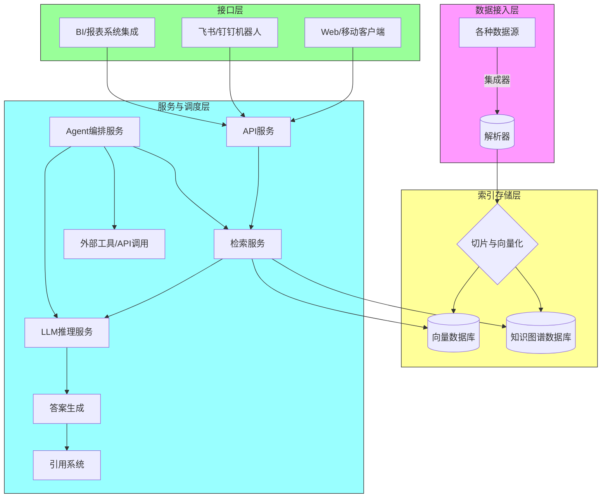

# 执行摘要

本文针对中国市场**研发一款“Glean式”企业知识管理系统**进行了全面调研与分析。首先，我们从**目标用户**、**场景需求**、**痛点问题**出发，明确了核心价值主张：**在中国监管环境下，为企业构建一个连接多源数据的智能知识图谱与AI助手**，帮助员工快速找到所需信息、生成内容并自动化任务。该产品结合了**跨平台连接器**、**向量检索+知识图谱**、**RAG问答引擎**、**AI Agent编排**等模块，实现“企业知识随提随答、具有引用溯源、安全可控”的体验。我们对标了国内外**企业级搜索和知识管理产品**（如Glean、飞书知识问答、钉钉AI搜问等），并结合中国环境特点（监管合规、自主可控、本地化需求），设计了商业模型和技术方案。

- **用户/客户群体**：以大中型企业为主，包括研发团队、销售支持、客服、HR等。主要人物画像包括：知识工作者（需要快速检索项目文档和邮件）、业务分析师（需要统一查询多系统业务数据）、新员工培训人员（快速了解公司流程）、管理层（汇总报告与决策支持）等。
- **核心价值主张**：打破信息孤岛，实现跨应用、多模态数据的**语义级检索和问答**，并通过**知识图谱与个性化助手**提升团队效率。产品强调**“可授权许可+可信回答”**，所有答案均带来源引用，保障信息安全和信任度【11†L15-L22】【9†L47-L50】。例如，当用户提出问题时，AI 助手会检索用户有权访问的所有消息、文档等信息，直接给出精准答案，并附带来源链接【9†L47-L50】【11†L15-L22】。
- **商业模式画布**：产品收费模式可采用**按使用量订阅制**（根据企业用户数和检索量分级收费），配合**专业服务费**（定制集成、培训等）。主要合作伙伴包括云服务厂商（华为云、阿里云等）、系统集成商和行业SaaS供应商。渠道方面可通过**直销**（销售/技术专家团队）、**渠道合作伙伴**（咨询公司、安全厂商）、**线上营销**等多种方式触达目标客户。
- **竞争格局与差异化**：国内已有飞书、钉钉、阿里千问等AI搜索产品，侧重点多为聊天助手与知识库查询【11†L15-L22】【9†L47-L50】。我们的差异化在于：**深度企业图谱与RAG技术**。参考Glean的做法，构建“**全公司级知识图谱+个人工作图谱**”，实现多跳检索和上下文理解【30†L196-L203】【34†L143-L148】。此外，产品定位**赋能工作流**，支持复杂Agent编排，可自动执行多步流程，区别于现有产品主要聚焦问答功能【14†L26-L29】【30†L196-L203】。
- **产品护城河**：技术护城河包括**丰富的企业级连接器**与**严格的权限体系**（确保数据安全合规），以及**知识图谱技术**（通过结构化实体关系解决LLM多跳推理的局限）【30†L196-L203】【34†L143-L148】。商业护城河体现在与大型企业IT系统的深度集成和持续迭代数据积累，形成难以复制的“**企业上下文语义索引**”。

下文将详细展开用户细分、场景梳理、痛点分析、功能架构及技术设计，并给出产品路标、运营指标、风险与对策。所有结论基于**最新行业报告、官方资料和技术文档**，确保对中国市场有针对性的可操作方案。

---

## 1. 用户/客户分析

- **目标客户（Customer Segments）**：以大中型企业为主，尤其是科技、制造、金融、咨询等行业。其特点是组织分散、数据孤岛严重、多种业务系统并存（如钉钉/飞书、邮件、文档库、CRM/ERP、知识库等）。这些企业中的主要知识工作者每天需要跨系统查找信息，但传统搜索效率低下。
- **用户角色（Personas）**：
  - **研发人员**：需要查看多套文档和代码库，查询历史设计决策、快速定位相关技术资料。痛点在于信息零散、检索关键词难记，影响开发效率。
  - **销售/客服**：需要在CRM、邮件、知识库等系统中查询客户信息、产品资料、方案文档等。痛点为多系统切换、回答客户问题花费时间。
  - **新员工/培训**：需要快速了解公司流程、培训材料、政策法规。痛点为缺乏集中入口，依赖老员工口传。
  - **管理层/决策者**：需要汇总团队工作进展、关键数据指标、市场洞察等，痛点在于数据分散、人工整理成本高。
- **场景分析（Scenarios）**：
  1. **跨系统知识检索**：用户在一个搜索框中输入自然语言问题（如“上季度销售目标完成率是多少？”），系统返回多来源综合答案，并展示引用来源【9†L103-L106】。
  2. **文档综合分析**：对多个相关PDF/报告生成概览总结，如同时阅读数篇技术文档或调研报告后的自动提炼关键信息，生成摘要和对比【9†L103-L106】【11†L15-L22】。
  3. **知识图谱导航**：基于组织内部元数据（项目、人员、部门、客户等）进行探索性查询，比如“列出与产品X相关的项目成员及文档”。
  4. **AI助手创作**：根据企业内部知识库和数据，自动生成PPT大纲、项目建议书或问题答案，如飞书场景中的“生成业务创见”【9†L123-L127】。
  5. **自动化Agent**：用户可构建自动工作流（例如审批查询、报告订阅），让AI自动从各系统收集信息并提交报告。
- **用户痛点（Pain Points）**：
  - 信息孤岛：不同团队、系统之间数据无法互通，**找不到所需信息**【34†L143-L148】【11†L15-L22】。
  - 检索低效：传统关键字搜索依赖精确匹配，用户难以搜到含糊表达或需要跨系统的答案【11†L15-L22】【9†L47-L50】。
  - **时间浪费**：花大量时间翻阅文档、邮件和聊天记录，延误决策和响应速度【9†L103-L106】【34†L143-L148】。
  - **知识流失**：隐性经验、会议纪要、非结构化数据难以沉淀和共享，员工离职容易导致知识断层。
  - 缺乏智能：现有系统多为静态存储或简单检索，不具备**推理和协同**能力，无法自动化复杂任务。
  - 数据安全顾虑：企业关心使用云或第三方AI是否会泄露敏感信息，需要**权限管控与数据加密**支持。

---

## 2. 产品定位与价值主张

基于上述分析，我们定位产品为**企业级“知识发现+工作AI”平台**，核心价值在于：

- **统一知识入口**：提供一个统一入口，跨部门、跨系统检索企业全部信息资源。用户只需一句自然语言提问，即可获得准确答案【9†L47-L50】【34†L143-L148】。
- **可信回答**：所有回答均基于用户实际有权限访问的资料，附带原文引用，提高用户信任度【11†L15-L22】【9†L103-L106】。
- **智能助手**：除了搜索，还支持智能摘要、自动报告生成、AI创作等功能，提升工作效率。例如，可自动梳理项目进展、给出业务决策建议【9†L123-L127】。
- **全方位集成**：集成企业常用工具（飞书/钉钉/微信企业号、邮件、文档库、CRM、ERP、代码库等），无需切换环境，实现无缝联通【11†L15-L22】【9†L47-L50】。
- **企业级安全**：严格的多租户隔离和权限控制机制，保证数据在本地或指定云上安全存储，满足中国合规要求（数据本地化、加密存储）【11†L15-L22】。
- **可扩展平台**：除即刻问答，还支持构建基于知识图谱的流程自动化Agent，面向未来实现员工任务智能化【30†L196-L203】【34†L143-L148】。

通过上述能力，产品帮助企业**“让知识真正可用”**，从被动存储转变为主动洞察和决策支持。引用Glean的说法：我们的企业图谱让AI“捕捉人员、项目、流程间关系，使AI理解企业业务胜过任何单个员工”【30†L196-L203】。价值主张简言之：**“企业知识触手可及，答案可靠可信”**。

---

## 3. 产品功能与特性

结合用户需求与技术可行性，我们将产品功能分为以下模块，并列出重点卖点：

- **多源连接器（Connectors）**：支持与**国内外主流应用系统**无缝集成，如飞书/钉钉、企业微信、邮箱（含Exchange/SMTP）、GitLab/GitHub、Jira/禅道等，以及自有文档库、数据库、OCR（扫描文档）等。类似Glean的100+连接器【34†L104-L112】【30†L324-L332】，连接器需解析权限元数据，构建安全索引。
- **知识索引引擎**：将接入的数据**切片(chunk)**并向量化，存入向量数据库（选型Milvus、Weaviate或腾讯云Milvus），同时建立知识图谱节点。核心算法包括智能分段（段落或语义单元）、embedding编码与**混合检索**（向量+关键词）相结合【34†L104-L112】【30†L324-L332】。需支持**多语言**（中文、英文等）以及表格/图片文字识别。
- **权限感知检索**：在检索阶段，通过**Filter**机制过滤不允许访问的文档。伪代码示例：
  ```python
  def retrieve(user, query):
      q_emb = encode(query)
      candidates = vector_db.search(q_emb, filter={"tenant":user.tenant, "visible_to":user.id})
      # 进一步按相关度+权限重排
      results = rank(candidates, key=lambda c: relevance(query, c))
      return [c for c in results if user.can_access(c.doc)]
  ```
  这样保证用户只能检索到自己有权限的知识【11†L15-L22】。
- **RAG问答引擎**：用户提出自然语言问题后，系统通过上下文拼接技术将多个相关片段送入大模型生成答案。上下文打包（context packing）采用图算法或启发式选择最相关且多样化的片段，保证覆盖主要线索【15†L196-L203】【9†L103-L106】。示例伪代码：
  ```python
  def context_pack(query, chunks, max_tokens):
      scored = sorted(chunks, key=lambda c: relevance(query,c), reverse=True)
      selected, used = [], 0
      for c in scored:
          if used + c.tokens > max_tokens: break
          if similar(c, selected) > 0.8: continue  # 避免冗余
          selected.append(c); used += c.tokens
      return selected
  ```
  输出答案时附带**来源引用**（标题/文档页码），类似飞书“所有信息有明确出处，可点击溯源”【9†L103-L106】。
- **知识图谱与推理**：与传统RAG不同，我们构建**企业级知识图谱**。节点包括人、项目、客户、产品等，边表示参与、拥有、协作等关系。图数据库（如图谱数据库Neo4j或DGraph）存储实体关系。检索时可多跳推理：例如用户问“谁负责项目X的技术对接？”，系统可从图谱知道“项目X→团队Y→负责人Alice”，再返回Alice相关档案或对话记录【30†L196-L203】【34†L143-L148】。
- **智能助理与Agent**：支持任务型Agent构建。用户可定义工作流（例如“每月第1天自动生成项目月报”），系统通过**Planner+Executor**模块自动触发检索、摘要、报告编写等。基于Glean Enterprise Graph的设想，智能助手将结合个人和组织上下文主动提供建议【30†L196-L203】。可借助国内大模型（如通义千问、悟道等）开发个性化对话接口。
- **协作与界面**：提供Web前端、聊天机器人（集成到飞书/钉钉群）和浏览器插件多种入口。支持多用户协作和知识分享。例如回答卡片可由用户补充注释、点赞，并纳入内部FAQ。结合“插件热区”示例，通过浏览器插件可在任意页面快速搜索企业知识。
- **安全与合规**：满足中国法规要求：数据默认部署在用户私有云或本地环境，所有AI推理过程在本地完成；接入系统需鉴权并记录审计日志；数据加密存储并备份；严格的RBAC权限模型和审计体系保护用户隐私【11†L15-L22】【34†L143-L148】。

### 功能卖点

- **全面整合**：打通企业所有数据源，用户只需在一个地方提问，即可获得从邮件、聊天、文档到ERP系统等多源信息的综合答案【34†L143-L148】【9†L47-L50】。
- **语义理解**：基于自然语言理解和深度学习，支持**模糊查询**与**上下文连续对话**。用户可以随时用口语式问句检索过去讨论、项目细节等，无需记住精确关键词【9†L65-L72】【11†L15-L22】。
- **高可信度**：答案附带溯源引用，完全基于企业内部内容，无外泄风险，解决了“**虚假信息**”担忧【11†L15-L22】【9†L103-L106】。
- **主动洞察**：利用知识图谱，系统能够在后台分析团队活动，为用户提供**个性化提示**或发现隐性关联（例如“您可能需要关注项目Y的最新进展”）。
- **增强生产力**：结合流程自动化与AI创作，减轻重复工作负担。例如，一键生成产品提案大纲或竞品分析报告，将企业知识转化为实际产出。
- **可本地部署/私有化**：面向对数据隐私要求高的行业（政府、金融），提供独立私有部署选项，确保合规安全。

### 产品护城河

- **技术壁垒**：自主构建的**连接器库**和**知识图谱技术**难以复制。我们将深度解析飞书/钉钉等API，与企业系统深度集成；同时，构造兼顾企业语义的知识图谱来辅助LLM推理，这是国内外少有的技术复杂度【30†L196-L203】【34†L143-L148】。
- **数据资产**：随着产品上线，企业内部累积的图谱和标签数据将成为重要资产，难以迁移或替代。同时，可利用用户行为反馈不断优化检索策略。
- **合规能力**：在中国市场，坚持**本地部署、合规审计**的方案，符合监管要求，与依赖国外云的竞品相比更易获得客户信任。
- **生态合作**：与ERP、BI工具、身份验证服务等深入合作，形成绑定效应，并借助渠道伙伴（如云厂商、咨询公司）扩大影响力。

---

## 4. 技术架构设计

我们设计了一个模块化的多租户架构，主要分为**数据层、索引层、服务层和应用层**。下图为高层次架构示意（Mermaid 格式，实际文档输出可用文字图形或设计图）：



- **数据接入层**：通过各种“连接器”，将应用系统（如飞书、钉钉、邮箱、文件系统、ERP/CRM）中的内容抓取并解析为可索引格式。解析器支持多文件类型（PDF、Office、Markdown、聊天记录JSON等），提取文本及元数据（作者、时间、权限标签）。
- **索引存储层**：对每个文档内容进行**切片(chunking)**，如按段落、表格行或语义单元分片，保留引用边界。然后对每个切片计算Embedding并存入向量数据库（可选Milvus、LanceDB等），同时在图数据库构建相关实体关系（如用户-项目-文档关联）。知识图谱可使用开源图数据库（如Neo4j、ArangoDB等）存储节点（项目、产品、客户、成员）和关系，丰富上下文语义【30†L196-L203】【34†L143-L148】。
- **检索与推理层**：提供检索服务和RAG问答服务。检索服务首先将用户查询转换为向量检索请求，同时进行权限过滤（伪代码见上）。检索到的TopK候选切片经过重排序（可能用cross-encoder模型提高关联度），然后执行**上下文打包**算法（逻辑见3.功能）以生成高质量Prompt给LLM。LLM推理可采用国产大模型（如通义千问、雪梨、太初等）或混合模型，内部注重支持超大上下文（引用Google的Gemini技术思路）【14†L26-L29】【15†L196-L203】。输出后，答案与引用标注服务组合，形成最终回答。
- **Agent编排层**：基于用户输入和任务需求，Planner模块将复杂需求拆解（例如分步查询、文件生成），调用检索与LLM服务，再由Executor调用外部工具（如表格API、邮件发送、企业系统API）完成任务。比如新员工入职时自动创建待阅任务列表，并生成培训指南。
- **应用接口层**：提供Web和API接口，供前端应用和企业内部系统调用。也可集成到飞书/钉钉等聊天平台，用户在常用工作平台中便可直接访问AI搜索与助理功能。

### 关键技术选型与细节

- **向量化模型**：可选适合中文的预训练模型，如百度文心ERNIE embedding、阿里飞浆预训练、或开源的E5/CLIP等。如需本地部署，可考虑轻量化模型（BGE-small、MiniLM）。
- **向量库**：国内推荐使用Milvus或腾讯自研的AI向量引擎，支持向量和稀疏检索混合，加速大型索引检索。
- **LLM模型**：根据客户需求选择。可同时支持自研模型（如阿里通义、百度文心）、或商用API（基于保密协议与监管规定）。对于M系列苹果Mac开发，推荐本地较小模型（Llama2/Mistral）做原型。
- **重排器（Reranker）**：可以采用双塔+交叉编码的混合方式，提高结果精度。可使用如Sentence-BERT进行初筛，用Cross-Encoder-BERT再评分。
- **引用系统**：为保障可信回答，维护“答案片段→原文位置”的映射。输出时以列表形式返回答案和多条Source（文档名+位置）【11†L15-L22】【9†L103-L106】。
- **权限模型**：结合RBAC/ABAC设计，对每条记录保存可访问用户/角色标签。检索和结果展示均需实时校验权限。例如，通过在向量搜索时加metadata过滤，防止检索到未授权数据【11†L15-L22】。
- **多租户**：支持企业级多租户。设计可以在数据库层面用租户ID隔离数据（Postgres Schema隔离、向量库Collection隔离），并通过应用网关（API网关）强制附加租户上下文。
- **部署方案**：可提供云端SaaS服务，也支持**私有云/本地部署**以满足中国网络与安全政策。支持混合部署：部分功能云化（如认证），核心搜索引擎部署在企业内网或指定云区域。满足《中国网络安全法》数据本地化要求。
- **合规与监管**：设计中嵌入数据审计与日志，对用户行为（查询、文档访问）记录审计日志。支持对模型输出进行稽核，敏感内容过滤等安全策略【11†L15-L22】。

### 功能优先级与待办列表

| 优先级 | 功能模块           | 具体特性与说明                                                                                                                                               | 开发难度 | 预期价值  |
|------|----------------|------------------------------------------------------------------------------------------------------------------------------------------------------------|-------|-------|
| 高   | 基础连接器体系       | 实现与飞书/钉钉/邮箱/文件系统/企业微信的同步接口，初步解析文档与消息，将资料存入系统。                                                                                 | 中     | 极高（数据源丰富保障系统实用性） |
| 高   | 向量检索与权限过滤    | 构建切片和向量化流程，部署向量搜索引擎，加入基于租户和用户的过滤逻辑，保证检索只返回授权内容【11†L15-L22】。                                                            | 高     | 极高（核心功能）    |
| 高   | QA问答引擎         | 集成中文大模型，实现检索后问答功能；输出带引用。需要研发上下文打包策略，确保多片段协同回答。                                                                               | 高     | 极高（用户核心需求）   |
| 中   | 知识图谱构建        | 在现有索引基础上，抽取实体与关系，构建简单知识图谱（项目-人员、文档-主题等），用于增强搜索与关系查询。                                                                    | 高     | 高     |
| 中   | 用户界面与交互      | 开发Web前端或聊天机器人插件，提供自然语言查询界面，显示答案与引用，并支持对话式多轮查询。                                                                               | 中     | 高     |
| 中   | AI摘要与创作助手     | 实现文档自动摘要、报告大纲生成等能力，提升信息加工效率。如在用户查询结果中自动输出“总结”和“行动建议”。【9†L103-L106】【9†L123-L127】                                                       | 中     | 中     |
| 中   | Agent任务自动化    | 实现简单的Agent流程，如自动日报、自动报告生成。可以按常用模板设计任务，并调用检索或通知模块。                                                                               | 高     | 高（差异化卖点）   |
| 低   | 企业知识图谱可视化   | 提供知识图谱浏览界面，让用户直观查看组织关系网络。                                                                                                                     | 中     | 低     |
| 低   | 多语言支持         | 扩展至英文/多语种能力。                                                                                                                                     | 高     | 低（增值功能）    |
| 低   | 第三方集成与API     | 开放接口供其他系统调用，如CRM、BI可链接查询。                                                                                                                   | 低     | 低     |

以上为初步功能列表，按需调整。其中**基础连接器、向量检索、QA引擎**为第一优先级，确保产品核心可用；**知识图谱与Agent**为下一步重要增值点；**UI与接入**可并行推进但易迭代。

---

## 5. 商业模式与渠道策略

- **客户关系**：采用**企业直销为主、免费试用为辅**的策略。通过行业展会、专业媒体、线上研讨会等多渠道获取线索，提供POC验证。销售团队结合技术咨询，开展项目落地，强化口碑。针对中大型客户，可提供定制化开发与培训服务增强绑定。
- **渠道合作**：与**云服务商**（华为云、阿里云、腾讯云等）合作，将产品打包至其市场；与**系统集成商**、**咨询顾问公司**（如安永、德勤等）共建解决方案。借助飞书/钉钉渠道（插件市场、集成商城）增加曝光。
- **收入模式**：主要为订阅制，按企业规模（席位数）、连接器数量、月活跃用户数等维度阶梯收费；辅助数据存储和计算资源费。可提供不同版本：基础版（核心检索与QA）、高级版（包含知识图谱和Agent）、企业版（定制化和私有部署）。另外可提供专业服务收入，包括部署咨询、二次开发、知识迁移顾问费等。
- **成本结构**：初期研发成本较高（AI模型和平台开发），运营成本包括服务器资源、模型使用许可（若采用付费API）、团队人力。后期可规模化，通过云原生架构控制运维成本。
- **关键伙伴**：需要与大模型提供商（百度/阿里/中科曙光等）合作获取高性能AI算力；与安全厂商和加密技术商合作，增强合规；与行业客户联合实验，加速应用场景落地；与高校/研究所合作优化知识图谱技术。

---

## 6. 竞争分析与差异化

| 产品/厂商      | 核心定位             | 关键特性                                          | 差异化要点                              |
|--------------|------------------|-----------------------------------------------|---------------------------------------|
| **Glean (美国)**  | 企业知识发现 AI 平台       | 100+连接器，个性化知识图谱，强检索+生成，Agent 自动化【30†L196-L203】【34†L143-L148】 | 深度图谱构建，多跳推理，全球化部署            |
| **飞书知识问答**  | 企业AI搜索与协作助手      | 语义搜索+实时联网，多格式解析，内容创作助手【9†L47-L50】【9†L103-L106】        | 集成飞书生态，注重聊天协作，主要问答+创作        |
| **钉钉AI搜问**  | 企业智能问答引擎        | 多源数据检索，答案带来源，权限管理，摘要生成功能【11†L15-L22】        | 紧贴钉钉OA场景，本地化服务，强调安全合规        |
| **达观知识库**   | 企业AI检索与知识管理平台   | 搜索场景定制化，语义检索+规则引擎，专注金融/政府等行业【20†L1-L9】      | 行业深耕能力，OCR和垂直领域优化               |
| **秘塔 AI搜索**  | AI搜索引擎           | 实时网络搜索、对话式界面、结构化答案【34†L151-L160】            | 类似Perplexity的公共搜索体验                   |
| **Notion AI** | 知识协作+个人数据库    | 笔记和数据库管理，AI写作助手                         | 侧重个人/小团队生产力，不专注企业多源检索           |

与**飞书知识问答**和**钉钉AI搜问**相比，我们的方案更加聚焦**企业级多源知识图谱+自动化**：不仅提供检索问答，还支持流程自动化（Agent）和深度分析。与**达观数据**等本土厂商相比，我们强调**用户体验和生成能力**（自然语言回答、内容创作）并结合**知名LLM技术**。与**国外平台**相比，我们突出**本地化部署、合规性和成本效益**，避免关键算力和数据依赖海外服务。

在中国市场，现有产品多依附于OA系统场景（问答、协同），缺乏类似Glean的“**知识图谱+多步骤Agent**”架构【30†L196-L203】【34†L143-L148】。因此，我们的竞争优势在于**全面整合+智能自动化**，不仅回答问题，还帮助用户“AI赋能每一个任务”，形成长期粘性。

---

## 7. 营销渠道与推广

- **线上推广**：通过专业网站、社交媒体（LinkedIn、知乎、微信公众号）、行业论坛发布案例研究白皮书，分享应用场景视频，提升品牌影响力。与媒体/自媒体合作做专题报道（如“数字化转型”、“AI生产力”）。SEO营销：撰写企业搜索、知识管理相关技术文章，并提供部分免费工具（如企业索引体验Demo）引流。
- **线下活动**：参加行业展会（数博会、云计算展等）、主办研讨会或闭门会邀请IT决策者，进行产品演示和技术分享。与行业协会合作，进行调研报告或白皮书发布，以教育市场。
- **客户引荐**：通过早期客户的成功案例积累口碑，推荐给同行业客户。可以为首批用户提供优惠价格和深度培训，快速获取落地应用案例。
- **合作伙伴**：与系统集成商、咨询公司形成战略合作，将本产品纳入其整体数字化解决方案。或与云服务商合作，通过其市场推广。
- **内部渠道**：若团队或投资方背景有大企业资源，可试点落地，通过内推或内部孵化等方式先在一个大型组织内部验证，然后扩散到其供应链或合作伙伴网络。

---

## 8. 定价与盈利模式

- **订阅制**：按照企业规模/员工数收费，分为基础版、专业版、企业版。基础版提供基本搜索和QA；专业版新增知识图谱和摘要；企业版支持私有化部署和高级Agent功能。单租户版按年收费（类似SaaS模式），私有化版可收取一次性部署费和运维费。
- **按需增值**：针对数据量或并发访问量，可额外收费。如文档数量、API调用次数、LLM推理时长等。
- **服务收入**：专业部署服务（实施、集成、定制）、培训、维护合同等。
- **长期合同**：大客户签订多年合约，确保长期收入可预见性。

我们假设**定价目标**：中大型企业，年人均授权费数百元至千元人民币（视功能模块而定），以规模化降低成本。可针对不同行业制定差异化套餐。

---

## 9. 路线图与里程碑

结合技术实现难度和商业需求，我们规划了**首个24个月的产品开发里程碑**：

```mermaid
gantt
    title 产品研发与市场推广时间线
    dateFormat  YYYY-MM
    section MVP (0-6月)
    核心连接器开发（钉钉/飞书/邮件/常用文档）   :done,  milestone1, 2026-05, 2026-08
    向量检索+检索接口                      :done,  milestone2, 2026-06, 2026-10
    简易Web搜索界面                        :done,  milestone3, 2026-07, 2026-11
    初步QA引擎集成（回答+来源引用）           :active, milestone4, 2026-09, 2026-12
    内部测试与优化                          :active,    2026-11, 2027-01

    section Beta (6-12月)
    扩展连接器（企业微信、ERP、GIT等）       :       2026-11, 2027-03
    权限系统与多租户支持                     :       2026-12, 2027-03
    AI摘要与报告生成功能                     :       2027-01, 2027-04
    用户界面体验优化与多端集成               :       2027-01, 2027-05
    Beta用户试点反馈                        :       2027-04, 2027-06

    section V1.0 (12-18月)
    知识图谱模块                              :       2027-06, 2027-09
    Agent自动化流程编排                      :       2027-07, 2027-10
    本地化部署与合规增强                     :       2027-08, 2027-12
    标准版产品发布（迭代1.0）               :done, milestone5, 2027-12

    section V2.0 (18-24月)
    深度行业定制解决方案                      :       2027-12, 2028-04
    高级分析与BI集成（可视化仪表盘）         :       2027-12, 2028-06
    AI能力强化（大模型升级、自动推理优化）   :       2028-02, 2028-06
    全球化&可扩展                           :       2028-04, 2028-08
    合作伙伴网络扩张                        :       2028-05, 2028-09
    完整产品发布（2.0）                    :       2028-08, 2028-09
```

- **MVP阶段（0–6月）**：实现核心检索功能：开发对接飞书、钉钉、邮箱、常见文档的连接器；建立向量数据库，提供搜索接口和基础Web前端；集成中文大模型，实现问答+引用的基本功能。【34†L143-L148】【9†L47-L50】
- **Beta优化（6–12月）**：扩展更多数据源、完善权限多租户架构；优化搜索结果排序和界面；增加自动摘要和业务报告功能。进行小范围用户测试并迭代改进。
- **1.0版本（12–18月）**：上线知识图谱功能和任务自动化Agent；解决大规模部署问题，发布企业版；并正式启动商务合作和市场推广，争取第一批付费客户。
- **2.0及以后（18–24月）**：聚焦**行业定制**（如金融、制造等），增加数据可视化和BI集成；引入更大规模模型或多模型混合优化推理能力；构建生态伙伴计划，扩大市场份额。

---

## 10. 关键指标与风险评估

### 关键成功指标（KPIs）

- **用户采用度**：DAU/MAU、检索次数、平均会话长度、客户续约率、企业部署数量。目标是在上线12个月内实现企业客户月活率≥30%，日活率≥10%。
- **检索效果**：查询应答准确度（人工评测）、平均响应时间、命中率（能正确回答用户问题的比例）。我们目标是查询响应时间<2秒，回答准确率≥80%（根据内部测试）。
- **业务影响**：用户反馈满意度、工时节省估计（如减少查找时间、加快报告生成时间）。例如，案例研究表明Glean客户月均可节省1500小时【14†L26-L29】，我们可参考指标。
- **财务指标**：首年付费客户数、付费转化率（试用转化）、ARR（年经常性收入）。目标是18个月内达到十几家以上付费大客户，实现可持续营收增长。
- **运营效率**：系统正常运行时间、故障恢复时间、每月新增知识文档量、插件使用数量等指标也需监控。

### 风险与对策

- **技术实现难度高**：语义检索和LLM成本大、开发复杂，存在效果不达预期风险。**对策**：以迭代开发和精益实验为原则，先做最小可行功能（MVP），通过内部数据不断优化模型和算法。可先使用已有API加速验证，再逐步替换成本更优的本地模型。
- **数据隐私合规风险**：在中国境内处理企业数据需严格遵守安全法律。**对策**：从设计初期即考虑数据加密和本地化部署，必要时提供私有化方案；遵循最低权限原则，保证检索和存储均在客户控制的环境中。
- **市场竞争压力**：飞书、钉钉等巨头已布局知识搜索，可能依托其生态形成壁垒。**对策**：与其形成差异化定位（如对非OA场景的覆盖、深度定制化服务），并可通过战略合作（如成为其知识库的搜索引擎）来获取用户。
- **用户习惯培养**：企业用户对新搜索工具可能采纳缓慢。**对策**：强调对现有工具的补充优势，如通过插件形式接入现有OA，不打破工作流程；快速上线可见价值的功能，让用户体验到节省时间和获得新洞察的效果。
- **成本控制**：LLM运算和数据存储成本高。**对策**：通过混合云部署、模型压缩技术、只对关键内容做深度分析等手段优化成本；灵活定价模型转嫁一部分资源费用。

---

## 11. 防御壁垒与长期竞争力

- **丰富连接器与生态**：持续扩展对接系统列表，建立行业标准化适配方案，使新客户快速落地。连接器与集成方案的积累能形成独特资产。
- **知识图谱资产**：企业专属的知识图谱与模型参数将随着使用累积，与数据绑定，形成不可替代的价值。这类似Glean所构建的“企业上下文图谱”【30†L196-L203】。
- **AI与数据能力**：拥有自研或深度定制的中文大模型集成能力，以及不断优化的检索+图谱算法；使得回答质量和智能化水平持续领先。
- **渠道与品牌**：若能与国内云巨头或龙头企业达成合作，打造行业标杆案例，将建立强大品牌影响力和渠道壁垒。
- **数据与用户网络效应**：随着用户使用产品，产生的用户行为数据、反馈可以用于优化模型和知识推荐。同时，在一个企业内形成“知识协同”，他人提出的问题和答案会提升整体系统智慧，形成正循环。

---

### 参考资料

- Glean 产品官网及技术文档【34†L143-L148】【30†L196-L203】【14†L26-L29】  
- 飞书官方知识问答与知识库介绍【9†L47-L50】【9†L103-L106】  
- 钉钉AI搜问产品概述【11†L15-L22】【11†L33-L36】  
- 达观数据《大模型AI搜索产品对比》行业报告【18†L65-L74】【34†L143-L148】  
- 其他行业分析与博客【14†L26-L29】【34†L143-L148】

以上内容基于公开资料与市场分析综合而成，可为在中国市场开发“Glean式”产品提供系统参考和实施思路。如需更详细的**具体架构图、数据库模型或原型演示**，后续可进一步提供。