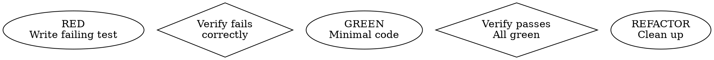

# Superpowers 项目深度洞察分析报告

> **分析日期**: 2026-05-13  
> **项目仓库**: https://github.com/obra/superpowers  
> **版本**: 5.1.0  
> **分析者**: AI Agent (Codeflicker)

---

## 🎯 执行摘要

Superpowers 是一个**完整的软件开发方法论系统**，为 AI 编码代理提供了一套可组合的技能（Skills）和初始指令。它通过将最佳实践嵌入 AI 代理的工作流程中，实现了从需求分析到代码实现的全流程自动化和质量保障。

**核心价值**:
- **方法论驱动**: 将 TDD、系统化调试、代码审查等软件工程最佳实践编码为可执行的技能
- **跨平台兼容**: 支持多个 AI 代理平台（Claude Code、Cursor、Codex、Gemini CLI 等）
- **自动触发机制**: 通过 hooks 系统在会话启动时自动加载，无需用户手动激活
- **子代理模式**: 创新性地使用 subagent-driven-development 实现任务隔离和高质量迭代

---

## 📂 项目结构分析

### 1. 核心目录组织

```
superpowers/
├── skills/                          # 核心技能库（18个技能）
│   ├── brainstorming/               # 设计和需求分析
│   ├── writing-plans/               # 实现计划编写
│   ├── subagent-driven-development/ # 子代理驱动开发
│   ├── test-driven-development/     # 测试驱动开发
│   ├── systematic-debugging/        # 系统化调试
│   ├── code-review/                 # 代码审查
│   ├── using-git-worktrees/         # Git worktree 管理
│   ├── writing-skills/              # 技能编写元技能
│   └── using-superpowers/           # 技能系统入门
│
├── hooks/                           # 生命周期钩子
│   ├── session-start                # 会话启动钩子（关键）
│   └── hooks.json                   # 钩子配置
│
├── .claude-plugin/                  # Claude Code 插件配置
├── .cursor-plugin/                  # Cursor 插件配置
├── .opencode/                       # OpenCode 插件配置
├── .codex-plugin/                   # Codex 插件配置
│
├── scripts/                         # 工具脚本
│   ├── bump-version.sh              # 版本管理
│   └── sync-to-codex-plugin.sh      # 跨平台同步
│
├── docs/                            # 文档目录
├── CLAUDE.md                        # AI 代理贡献指南（重要）
└── README.md                        # 项目文档
```

### 2. 目录设计特点

**扁平化技能命名空间**:
- 所有技能都在 `skills/` 下一级目录
- 没有多层嵌套，便于搜索和发现
- 每个技能独立目录包含 `SKILL.md` 和可选的支持文件

**平台无关的核心**:
- 技能内容与平台无关
- 通过不同的插件配置适配各平台
- 统一的 hooks 机制实现自动加载

---

## 🏗️ 架构设计洞察

### 1. 核心架构模式

#### **技能即代码（Skills as Code）**

Superpowers 将软件工程最佳实践视为"可执行代码"，而非传统文档：

```yaml
---
name: test-driven-development
description: Use when implementing any feature or bugfix, before writing implementation code
---
# 技能内容定义了"程序"的执行逻辑
```

**关键设计原则**:
- 技能文档使用 YAML frontmatter 声明元数据
- `description` 字段定义触发条件（而非功能描述）
- 技能内容包含可执行流程图（使用 Graphviz dot 格式）
- AI 代理将技能内容视为"指令"而非"参考文档"

#### **Hook-based 生命周期管理**

```bash
# hooks/session-start 脚本
# 在会话启动时自动注入 using-superpowers 技能内容
session_context="<EXTREMELY_IMPORTANT>
You have superpowers.
${using_superpowers_escaped}
</EXTREMELY_IMPORTANT>"
```

**设计亮点**:
- 会话启动时自动加载引导技能
- 引导技能建立"技能优先"的行为模式
- 避免用户手动激活的认知负担
- 跨平台兼容（通过检测环境变量输出不同格式）

#### **Subagent Pattern（子代理模式）**

这是 Superpowers 最创新的架构设计：

```
主代理（Controller）
    ↓ 调度任务
子代理 A（Implementer） → 实现 Task 1
    ↓ 完成后
子代理 B（Spec Reviewer） → 检查是否符合规范
    ↓ 通过后
子代理 C（Code Quality Reviewer） → 检查代码质量
    ↓ 通过后
主代理继续下一个任务
```

**核心优势**:
1. **上下文隔离**: 每个子代理只接收当前任务的完整上下文，避免信息污染
2. **专业化分工**: 实现、规范审查、质量审查由不同子代理负责
3. **模型分层**: 简单任务使用低成本模型，复杂任务使用高性能模型
4. **可测试性**: 主代理可以测试子代理的输出质量

---

### 2. 技能系统设计

#### **技能发现机制（CSO - Claude Search Optimization）**

```yaml
# ❌ 错误示例：描述了技能内容
description: Use for TDD - write test first, watch it fail, write minimal code, refactor

# ✅ 正确示例：只描述触发条件
description: Use when implementing any feature or bugfix, before writing implementation code
```

**设计洞察**:
- `description` 只描述"何时使用"，不描述"如何使用"
- AI 代理通过 description 决定是否加载技能
- 如果 description 包含流程描述，AI 可能跳过读取完整技能内容
- 这是通过实际测试发现的行为模式

#### **技能分类体系**

| 类型 | 特征 | 示例 |
|------|------|------|
| **Process Skills** | 定义工作流程，必须严格遵守 | `test-driven-development`, `systematic-debugging` |
| **Workflow Skills** | 定义协作模式，可灵活调整 | `brainstorming`, `writing-plans` |
| **Meta Skills** | 定义如何创建技能 | `writing-skills`, `using-superpowers` |
| **Reference Skills** | 提供参考信息 | `code-review/references/*` |

#### **技能优先级系统**

```
1. 用户显式指令（CLAUDE.md, AGENTS.md）
2. Superpowers 技能
3. 默认系统提示词
```

这种设计确保用户始终拥有最高控制权，技能只是默认行为。

---

### 3. 工作流设计模式

#### **完整开发流程**

```
brainstorming
    ↓ 产出设计文档
using-git-worktrees
    ↓ 创建隔离工作区
writing-plans
    ↓ 产出实现计划
subagent-driven-development
    ↓ 执行计划（每个任务独立子代理）
        ↓ 每个任务内部
        test-driven-development（RED-GREEN-REFACTOR）
        ↓ 任务完成后
        spec-reviewer（检查是否符合规范）
        ↓
        code-quality-reviewer（检查代码质量）
    ↓ 所有任务完成
finishing-a-development-branch
```

**流程图使用**:
- 每个关键技能都包含 Graphviz dot 格式的流程图
- 流程图使用 `diamond`（判断节点）和 `box`（执行节点）
- AI 代理可以精确理解执行顺序和条件分支

#### **TDD 实践嵌入**



**关键规则**:
- **Iron Law**: 没有失败测试就不写代码
- **Verification**: 必须观察测试从红变绿
- **Deletion**: 先写代码的必须删除重来

这种"强制性"通过技能文档中的明确指令实现。

---

## 🛠️ 技术栈分析

### 1. 核心技术

| 技术 | 用途 | 依赖级别 |
|------|------|----------|
| **Bash** | Hooks 脚本实现 | 核心依赖 |
| **JSON** | 插件配置和 Hook 输出 | 核心依赖 |
| **Markdown** | 技能文档格式 | 核心依赖 |
| **YAML** | Frontmatter 元数据 | 核心依赖 |
| **Graphviz (dot)** | 流程图定义 | 可选依赖 |
| **Git** | 版本控制和 worktree | 核心依赖 |

### 2. 零依赖设计理念

```json
{
  "name": "superpowers",
  "version": "5.1.0",
  "type": "module",
  "main": ".opencode/plugins/superpowers.js"
  // 没有 dependencies 字段
}
```

**设计决策**:
- 不引入任何 npm 包依赖
- 所有功能通过 Shell 脚本和文本文件实现
- 便于安装、部署和维护
- 避免依赖冲突和版本管理问题

### 3. 跨平台兼容实现

#### **Hook 输出格式自适应**

```bash
# hooks/session-start
if [ -n "${CURSOR_PLUGIN_ROOT:-}" ]; then
  # Cursor 格式（snake_case）
  printf '{"additional_context": "%s"}\n' "$session_context"
elif [ -n "${CLAUDE_PLUGIN_ROOT:-}" ]; then
  # Claude Code 格式（嵌套）
  printf '{"hookSpecificOutput": {"additionalContext": "%s"}}\n' "$session_context"
else
  # 标准 SDK 格式
  printf '{"additionalContext": "%s"}\n' "$session_context"
fi
```

**兼容策略**:
- 通过环境变量检测当前平台
- 输出符合各平台期望的 JSON 格式
- 避免在 Claude Code 中重复注入内容

---

## 💡 核心实现模式总结

### 1. 行为塑造模式（Behavior Shaping）

**Red Flags Table Pattern**:

```markdown
| 想法 | 现实 |
|------|------|
| "这个太简单不需要测试" | 简单代码也会出错，测试只需30秒 |
| "我稍后再写测试" | 后写的测试证明不了任何事 |
```

**设计目的**:
- 预判 AI 代理可能产生的"合理化"借口
- 通过列举常见借口并直接反驳，阻止跳过步骤
- 这是通过大量实践测试发现的有效模式

### 2. 强制性检查点模式（Hard Gates）

```markdown
<HARD-GATE>
Do NOT invoke any implementation skill, write any code, scaffold any project, 
or take any implementation action until you have presented a design and the 
user has approved it. This applies to EVERY project regardless of perceived simplicity.
</HARD-GATE>
```

**实现手段**:
- 使用醒目的 XML 标签包裹关键规则
- 使用全大写和强调词（MUST, DO NOT, EVERY）
- 明确禁止"简单项目例外"的合理化

### 3. 反模式识别模式（Anti-Pattern Detection）

每个技能都包含"Common Rationalizations"部分：

```markdown
| 借口 | 现实 |
|------|------|
| "紧急情况没时间做流程" | 系统化调试比瞎猜更快 |
| "先试试这个快速修复" | 第一次修复决定了后续模式 |
```

**教学策略**:
- 让 AI 代理预先识别自己可能的捷径想法
- 提供反驳论据，建立"走捷径实际更慢"的认知

### 4. 分层验证模式（Layered Verification）

在 `subagent-driven-development` 中：

```
Implementer（实现） 
    → Self-review（自查）
    → Spec Reviewer（规范审查）
    → Code Quality Reviewer（质量审查）
```

**质量保证**:
- 实现者自查：捕获明显问题
- 规范审查：确保不多不少（YAGNI）
- 质量审查：确保实现优雅

---

## 🔍 深层设计洞察

### 1. AI 代理行为模型

Superpowers 基于对 AI 代理行为的深刻理解：

**AI 的自然倾向**:
- 倾向于立即行动（跳过设计阶段）
- 倾向于实现超出需求的功能（忽视 YAGNI）
- 倾向于跳过测试（觉得"太简单"）
- 倾向于猜测式修复（缺乏系统化调试）

**Superpowers 的对策**:
- 在技能中嵌入"STOP"检查点
- 使用流程图强制顺序执行
- 使用 Red Flags 表预判并反驳合理化借口
- 要求显式声明"使用XX技能"建立承诺

### 2. 文档即程序（Documentation as Program）

传统文档：描述"应该"做什么  
Superpowers 技能：定义"必须"如何做

**技术实现**:
```markdown
## Checklist

You MUST create a task for each of these items and complete them in order:

1. **Explore project context**
2. **Offer visual companion**
3. **Ask clarifying questions**
...
```

AI 代理将其解析为：
```python
tasks = [
    "explore_project_context",
    "offer_visual_companion",
    "ask_clarifying_questions",
]
for task in tasks:
    execute(task)
    mark_complete(task)
```

### 3. 上下文管理策略

**主代理的职责**:
- 维护全局视图（整个计划、所有任务）
- 提取和准备子代理需要的上下文
- 协调任务顺序和依赖关系

**子代理的职责**:
- 只接收单个任务的完整描述
- 不继承主代理的会话历史
- 完成任务并报告状态（DONE/BLOCKED/NEEDS_CONTEXT）

**为什么有效**:
- 避免上下文污染（子代理不会被无关信息干扰）
- 降低 token 成本（每个子代理只处理小任务）
- 提高成功率（明确的任务边界）

---

## 📊 质量保证机制

### 1. 自验证系统

#### **Spec Self-Review**（规范自查）

在 `brainstorming` 技能中：

```markdown
1. **Placeholder scan**: 任何 "TBD", "TODO" 未完成部分？修复它们。
2. **Internal consistency**: 有矛盾的部分吗？
3. **Scope check**: 范围是否适合单个实现计划？
4. **Ambiguity check**: 有歧义的需求？选择一个并明确化。
```

#### **Plan Self-Review**（计划自查）

在 `writing-plans` 技能中：

```markdown
1. **Spec coverage**: 规范中的每个需求都有对应任务吗？
2. **Placeholder scan**: 寻找"TBD"、"TODO"等占位符
3. **Type consistency**: 类型、方法签名在所有任务中一致吗？
```

### 2. 测试驱动的技能开发

`writing-skills` 技能本身定义了如何使用 TDD 开发技能：

```markdown
| TDD 概念 | 技能创建 |
|----------|----------|
| 测试用例 | 压力场景（用子代理） |
| 生产代码 | 技能文档（SKILL.md） |
| 测试失败（RED） | 没有技能时代理违反规则 |
| 测试通过（GREEN） | 有技能时代理遵守规则 |
| 重构 | 找到新的合理化借口并修补 |
```

**实践步骤**:
1. 运行基线场景（没有技能）→ 观察 AI 违规行为
2. 记录具体的合理化借口
3. 编写技能文档针对这些借口
4. 重新测试 → 验证 AI 现在遵守规则
5. 尝试突破技能 → 发现新漏洞 → 修补

### 3. 渐进式质量改进

从 `CREATION-LOG.md` 和 `test-pressure-*.md` 文件可以看出：

- 技能通过多轮"压力测试"不断改进
- 每次测试发现新的绕过方式
- 技能文档更新以堵住漏洞
- 这是一个持续迭代的过程

---

## 🎓 可复用的设计原则

### 1. 显式优于隐式（Explicit over Implicit）

**实践**:
- 要求 AI 代理显式声明"我正在使用XX技能"
- 使用 TODO 系统跟踪任务进度（而非依赖代理记忆）
- 技能中明确列出所有步骤（而非"适当处理"）

**来源**: Python 之禅

### 2. 约束产生自由（Constraints Enable Freedom）

**实践**:
- TDD 的严格规则（测试先行）反而让重构更自由
- Git worktree 的隔离约束让实验更大胆
- 计划的详细程度让子代理执行更高效

**哲学**: 好的约束减少决策负担，提高执行质量

### 3. 失败是功能（Failure as Feature）

**实践**:
- 必须观察测试失败（验证测试有效）
- 压力测试技能直到找到失败点
- BLOCKED 状态是有效反馈（不是错误）

**来源**: Netflix Chaos Engineering

### 4. 单一职责递归（Single Responsibility Recursively）

**实践**:
- 每个技能只关注一个工作流阶段
- 每个子代理只执行一个任务
- 每个测试只验证一个行为

**来源**: SOLID 原则的递归应用

### 5. 最小惊讶原则（Principle of Least Astonishment）

**实践**:
- 技能名称直接描述用途（`test-driven-development`）
- 目录结构扁平且可预测
- Hook 机制透明且可调试

### 6. 默认安全（Safe by Default）

**实践**:
- 自动创建隔离的 worktree（而非在主分支工作）
- 默认启用所有技能（而非可选）
- 先设计后编码（HARD-GATE 强制）

---

## 🔧 实施建议

### 对于想要采用类似方法的团队

#### **1. 从核心工作流开始**

不要试图一次性实现所有技能，优先顺序：

1. **基础工作流**:
   - `using-superpowers`（引导技能）
   - `test-driven-development`（质量基础）
   - `systematic-debugging`（问题解决）

2. **协作工作流**:
   - `brainstorming`（需求澄清）
   - `writing-plans`（任务分解）

3. **高级工作流**:
   - `subagent-driven-development`（自动化执行）
   - `code-review`（质量保证）

#### **2. 建立反馈循环**

```
编写技能 → 压力测试 → 发现绕过方式 → 修补漏洞 → 重测
```

**工具支持**:
- 使用子代理进行技能测试
- 记录每次测试中 AI 的"合理化"借口
- 将这些借口加入"Red Flags"表

#### **3. 设计可观测性**

- 要求 AI 显式声明使用的技能
- 使用 TODO 系统跟踪进度
- 保存设计文档和计划文档
- 记录审查结果

#### **4. 平衡严格性与灵活性**

**严格遵守**:
- Process Skills（TDD、调试流程）
- 质量检查点（测试必须先失败）
- 隔离机制（worktree、子代理）

**灵活调整**:
- 具体的命名约定
- 目录结构偏好
- 工具选择（git vs 平台原生）

---

## 🚀 创新亮点

### 1. Hook-based 自动激活

**问题**: 用户忘记启用最佳实践  
**解决方案**: 在会话启动时自动注入引导技能  
**影响**: 零学习成本，默认高质量

### 2. Subagent-driven Development

**问题**: 长上下文导致质量下降  
**解决方案**: 每个任务用独立子代理执行  
**影响**: 高质量 + 可并行 + 低成本（任务分层）

### 3. 技能即测试用例

**问题**: 难以验证技能有效性  
**解决方案**: 用子代理测试技能（TDD for Docs）  
**影响**: 技能质量可验证、可迭代改进

### 4. Red Flags 预判模式

**问题**: AI 会找理由跳过步骤  
**解决方案**: 预先列出常见借口并反驳  
**影响**: 显著减少违规行为

### 5. 跨平台无缝兼容

**问题**: 不同 AI 平台 API 不同  
**解决方案**: 技能内容平台无关，Hook 自适应输出格式  
**影响**: 一次编写，处处运行

---

## 📈 适用领域扩展

Superpowers 的设计模式可以应用到其他领域：

### 1. AI Agent 系统

- **ChatGPT Plugins**: 移植技能系统到 GPT Actions
- **LangChain**: 将技能转换为 Tool/Chain
- **AutoGPT**: 提供类似的工作流约束

### 2. 团队协作规范

- **Code Review Guidelines**: 从 `code-review` 技能学习结构化审查
- **Onboarding Docs**: 用 Checklist 模式编写入职文档
- **Runbooks**: 用流程图 + 步骤编写运维手册

### 3. 教育和培训

- **编程教学**: 将 TDD 技能作为教学材料
- **最佳实践培训**: 用 Red Flags 表教授反模式识别
- **导师系统**: 用子代理模式设计分级任务系统

### 4. 流程自动化

- **CI/CD Pipeline**: 用技能模式定义构建步骤
- **质量门禁**: 实现分层验证模式
- **自动化测试**: 借鉴 TDD 的强制验证思想

---

## 🎯 关键成功因素

### 1. 高度的自我意识

Superpowers 展现了对 AI 代理行为模式的深刻理解：
- 知道 AI 会在哪里走捷径
- 知道如何通过文档"编程" AI 行为
- 知道强制性检查点放在哪里

### 2. 实践验证的迭代

- 不是理论推导出的"完美设计"
- 而是通过大量实践测试不断改进
- `test-pressure-*.md` 文件记录了这个过程

### 3. 用户体验优先

- 零配置自动启用（Hook 机制）
- 自然语言触发（description 字段）
- 渐进式采用（可以只用部分技能）

### 4. 开放的贡献生态

`CLAUDE.md` 中明确的贡献指南：
- 严格的质量标准（94% PR 拒绝率）
- 要求人类审查所有 PR
- 禁止批量/低质量贡献
- 鼓励高质量、深度理解的贡献

---

## 🔮 未来展望

### 可能的演进方向

1. **技能市场化**:
   - 领域特定技能（前端、后端、DevOps）
   - 语言特定技能（Python、Rust、Go）
   - 组织特定技能（公司内部标准）

2. **可视化工具**:
   - 技能执行流程可视化
   - 子代理调度图
   - 质量指标仪表板

3. **更细粒度的模型选择**:
   - 根据任务复杂度自动选择模型
   - 成本/质量权衡优化
   - 本地 vs 云端模型混合

4. **跨会话持久化**:
   - 技能使用历史
   - 个性化技能推荐
   - 团队协作技能共享

---

## 📚 参考资源

### 项目资源

- **官方仓库**: https://github.com/obra/superpowers
- **插件市场**: https://claude.com/plugins/superpowers
- **社区 Discord**: https://discord.gg/35wsABTejz
- **博客**: https://blog.fsck.com/2025/10/09/superpowers/

### 相关概念

- **Test-Driven Development**: Kent Beck, "Test-Driven Development by Example"
- **Behavior-Driven Development**: Dan North
- **Chaos Engineering**: Netflix Tech Blog
- **Five Whys**: Toyota Production System
- **SOLID Principles**: Robert C. Martin

### 技能规范

- **Agent Skills Specification**: https://agentskills.io/specification
- **Anthropic Best Practices**: `skills/writing-skills/anthropic-best-practices.md`

---

## 🎬 结语

Superpowers 不仅仅是一个技能库，它是对"如何让 AI 代理按照最佳实践工作"这个问题的系统性回答。

**核心洞察**:
1. **文档即代码**: 用文档"编程" AI 行为
2. **约束即自由**: 严格的流程带来更高的质量
3. **隔离即可靠**: 上下文隔离提高成功率
4. **测试即信心**: TDD 应用于技能本身的开发

**可复用模式**:
- Checklist 驱动执行
- Red Flags 预判反模式
- 流程图强制顺序
- 分层验证保证质量
- 子代理隔离上下文

**适用场景**:
- AI Agent 系统开发
- 团队工作流规范
- 自动化流程设计
- 教育培训材料

Superpowers 证明了：通过精心设计的"技能"，可以让 AI 代理达到接近人类专家的工作质量。这为 AI 辅助软件开发的未来提供了一个可行且优雅的范式。

---

**报告生成**: 2026-05-13  
**分析工具**: AI Agent (Codeflicker)  
**项目版本**: Superpowers v5.1.0  
**报告版本**: 1.0
