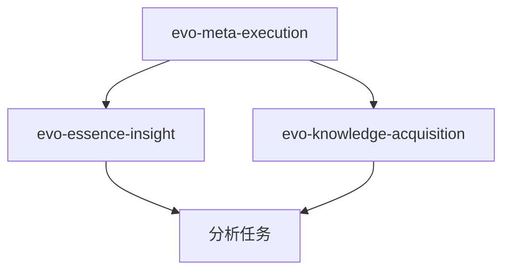

# Skill 设计模式 Cookbook

> **从优秀示例中提炼的可复用模式**  
> 调研日期：2026-04-30  
> 来源：knowledge-management/skill/ 深度分析

---

## 模式索引

| 模式名称 | 用途 | 难度 | 示例来源 |
|---------|------|------|---------|
| [门禁模式](#pattern-1-门禁模式-gate-pattern) | 强制验证和质量保障 | ⭐ | `brainstorming`, `meta-execution` |
| [检查清单模式](#pattern-2-检查清单模式-checklist-pattern) | 结构化验证 | ⭐ | `meta-execution`, `essence-insight` |
| [渐进式披露模式](#pattern-3-渐进式披露模式-progressive-disclosure) | 分层展示复杂信息 | ⭐⭐ | `essence-insight` |
| [并行执行模式](#pattern-4-并行执行模式-parallel-execution) | 性能优化 | ⭐⭐⭐ | `session-learning` |
| [自适应激活模式](#pattern-5-自适应激活模式-adaptive-activation) | 智能触发 | ⭐⭐ | `meta-execution` |
| [错误重试协议](#pattern-6-错误重试协议-error-retry-protocol) | 容错处理 | ⭐⭐ | `meta-execution` |
| [检查点模式](#pattern-7-检查点模式-checkpoint-pattern) | 状态保存和恢复 | ⭐⭐ | `meta-execution` |
| [四问框架模式](#pattern-8-四问框架模式-four-questions-framework) | 结构化分析 | ⭐⭐ | `product-thinking` |
| [反模式文档模式](#pattern-9-反模式文档模式-anti-pattern-documentation) | 知识沉淀 | ⭐ | 所有示例 |
| [依赖声明模式](#pattern-10-依赖声明模式-dependency-declaration) | 技能组合 | ⭐ | `knowledge-acquisition`, `essence-insight` |

---

## Pattern 1: 门禁模式 (Gate Pattern)

### 问题
如何确保关键步骤不被跳过？如何强制执行必要的验证？

### 解决方案

**硬门禁（Hard Gate）**：阻断式验证

```markdown
<HARD-GATE>
Do NOT invoke any implementation skill, write any code, 
or take any implementation action until you have presented 
a design and the user has approved it.
</HARD-GATE>
```

**软门禁（Soft Gate）**：检查式验证

```markdown
## 🚨 Critical Rules（不能绕过的禁止项）

- ❌ **禁止在续接会话时跳过上下文恢复**
- ❌ **禁止第2次失败时重复相同操作**
- ❌ **禁止在未过交付审查三阶段前交付**
```

### 示例代码

```markdown
## 交付审查三阶段（必须通过）

### Stage 1: 规格符合审查
- [ ] 用户要求的每一条都有对应输出吗？
- [ ] 有没有漏掉"顺便XXX"的附加要求？
- [ ] 有没有做用户没要求的事？

未通过 Stage 1 → 禁止进入 Stage 2

### Stage 2: 质量审查
- [ ] 有没有明显的事实/逻辑错误？
- [ ] 用户能看懂吗？
- [ ] 格式整齐吗？

未通过 Stage 2 → 禁止进入 Stage 3

### Stage 3: 输出规范检查
- [ ] 网页/HTML 需要打开预览吗？
- [ ] 图片需要展示给用户吗？
- [ ] 代码能直接运行吗？

三阶段全部通过 → 允许交付
```

### 最佳实践

1. **使用视觉标记**：`<HARD-GATE>`, `🚨`, `❌` 增强可识别性
2. **分级门禁**：P0（必须）、P1（推荐）、P2（可选）
3. **明确后果**：说明不遵守的后果（"将导致XX问题"）
4. **可验证性**：每个门禁都有明确的检查标准

### 适用场景
- 质量关键任务
- 多阶段工作流
- 需要用户确认的步骤
- 容易出错的环节

---

## Pattern 2: 检查清单模式 (Checklist Pattern)

### 问题
如何确保复杂任务的每个步骤都被执行？如何标准化验证流程？

### 解决方案

**结构化检查清单**：

```markdown
## 启动准备检查清单

### 🔴 必做核心（每次任务都要过）

□ 需求理解：我真的理解用户想要什么吗？有模糊点吗？
□ 技能检查：有匹配的专业技能可以辅助吗？
□ 经验回顾：从记忆系统中检索与当前任务相关的历史经验
□ 方案预演：脑中走一遍流程，有没有明显的问题？

### 🟡 复杂任务扩展（按需启用）

□ 苏格拉底式提问：先问清范围/预期/约束，再动手
□ 设计先行：分块展示方案，确认后再执行
□ 任务原子化：拆分为可独立验证的小任务
```

**分级检查清单**：

```markdown
## 洞察输出检查清单

### Level 1: 基础（Must-Have）
- [ ] 我的知识储备够吗？
- [ ] 我标注了置信度吗？
- [ ] 我寻找过反例吗？

### Level 2: 质量（Nice-to-Have）
- [ ] 我设置了验证点吗？
- [ ] 颗粒度合适吗？

### Level 3: 卓越（Excellence）
- [ ] 我找到了一个好的类比吗？
- [ ] 这个类比受众一定熟悉吗？
- [ ] 听了类比，受众会"秒懂"吗？
```

### 实现技巧

**1. 使用 Markdown 任务列表**

```markdown
- [ ] 未完成项
- [x] 已完成项
```

**2. 使用表格形式**

```markdown
| 检查项 | 说明 | 通过标准 |
|--------|------|---------|
| 完整性 | 用户要求都实现了吗？ | 100%覆盖 |
| 正确性 | 逻辑是否正确？ | 无明显错误 |
```

**3. 使用条件分支**

```markdown
IF 任务复杂度 > 5步 THEN
  □ 启用三文件规划系统
  □ 创建 task_plan.md
  □ 创建 findings.md
  □ 创建 progress.md
```

### 最佳实践

1. **优先级排序**：必做 > 推荐 > 可选
2. **可执行性**：每项都应该是动作，而非状态描述
3. **可验证性**：明确的通过标准
4. **简洁性**：单个清单不超过10项

### 适用场景
- 多步骤流程
- 质量验证
- 状态追踪
- 标准化操作

---

## Pattern 3: 渐进式披露模式 (Progressive Disclosure)

### 问题
如何处理复杂的多层次信息？如何避免信息过载？

### 解决方案

**分层框架**：从简单到复杂

```markdown
## 五层洞察框架

### L1: 表象观察
[收集现象，易于理解]

### L2: 本质规律 + 类比
[归纳规律，核心洞察]

### L3: 规律映射 ⭐
[验证规律，逐一对应]

### L4: 规律演变
[预测变化]

### L5: 现实预测
[未来推演]
```

**三段式表格**：

```markdown
| 阶段 | 现实 | 类比 |
|------|------|------|
| **✅ L3 已验证** |
| 1.0 工具 | Copilot Tab补全 | 学徒填色 |
| 2.0 自主 | Claude Code自主完成 | 熟练工干活 |
| 3.0 工业化 | Codex多Agent并行 | 流水线工厂 |
| **🔄 L4 各阶段演变** |
| 1.0 工具 | 补全型产品消亡 | 学徒被机器替代 |
| 2.0 自主 | 单Agent成基础能力 | 熟练工成标配 |
| 3.0 工业化 | 从监督→自我质检 | 流水线→无人工厂 |
| **🔮 L5 新阶段** |
| 4.0 全自动 | 24/7无人值守系统 | 无人工厂 |
| 5.0 自进化 | AI自主优化代码 | 工厂自己升级 |
```

### 实现技巧

**1. 使用折叠/展开**

```markdown
<details>
<summary>点击查看详细分析</summary>

[详细内容]

</details>
```

**2. 使用引用渐进**

```markdown
> 核心结论（5秒速览）

详细分析（2分钟阅读）：
...

深度研究（10分钟深入）：
见 `references/deep-dive.md`
```

**3. 使用分段标记**

```markdown
## 快速参考 ⚡
[核心内容]

## 详细说明 📖
[完整内容]

## 高级主题 🚀
[进阶内容]
```

### 最佳实践

1. **每层独立价值**：用户可以在任何层次停下
2. **层次递进**：从具体到抽象，从简单到复杂
3. **视觉区分**：使用图标、颜色、分隔线
4. **快速导航**：提供跳转链接

### 适用场景
- 复杂分析报告
- 多层次知识
- 不同受众需求
- 长文档组织

---

## Pattern 4: 并行执行模式 (Parallel Execution)

### 问题
如何提高长任务的执行效率？如何充分利用并发能力？

### 解决方案

**并行执行框架**：

```markdown
## 并行模式（优先）

### 触发条件
- ✅ `use_subagent` 工具可用
- ✅ 对话轮次 ≥ 10
- ✅ `parallel_mode: true`（Skill frontmatter 配置）

### 执行流程

Step 1: 加载共享上下文
  - 读取 session 存档文件
  - 准备提取规则文档

Step 2: 并行启动专项提取 Agent
  for category in [solutions, tools, patterns, insights, memories, rules, skills]:
      use_subagent(
          subagent_name="knowledge-extractor",
          task=f"从 session 中提炼 {category} 相关知识",
          background=false
      )
  # 7个子Agent并发执行，互不阻塞

Step 3: 等待所有子 Agent 返回
  - 容错机制：单个分类失败不影响其他
  - 超时保护：单个子 Agent 超时 30s 自动跳过

Step 4: 合并提取结果
  - 解析每个子 Agent 返回的 JSON 数组
  - 去重（同一文件名的多个条目合并）
  - 验证文件名格式

Step 5: 批量写入文件
  - 使用信号量限流（最多 5 个并发写入）
  - 每个文件使用原子写入模式
```

**性能对比展示**：

```markdown
### 性能提升统计

| 对话规模 | 串行模式 | 并行模式 | 加速比 |
|---------|---------|---------|--------|
| 小型 (10-20轮) | 15s | 8s | 1.9x |
| 中型 (30-50轮) | 35s | 10s | 3.5x |
| 大型 (60+轮) | 70s | 12s | **5.8x** ⚡ |
```

### 实现技巧

**1. 降级策略**

```markdown
## 串行模式（降级兜底）

### 自动降级条件（满足任一即降级）
1. `use_subagent` 工具不可用
2. 对话轮次 < 10（小对话无需并行）
3. 任意子 Agent 超时（> 30s）
4. `parallel_mode: false`（手动禁用）

### 降级日志
⚠️ 并行模式不可用，回退到串行模式
原因：use_subagent 工具未启用
预计耗时：35s（vs 并行模式 6s）
```

**2. 流式进度反馈**

```markdown
🚀 开始知识提炼（7 个分类并行）...

✅ [solutions] 提炼完成 → 1 个文件
✅ [tools] 提炼完成 → 1 个文件
✅ [patterns] 无可提炼内容
✅ [insights] 提炼完成 → 1 个文件
⏳ [memories] 处理中...
✅ [memories] 提炼完成 → 2 条候选
✅ [rules] 无可提炼内容
✅ [skills] 提炼完成 → 1 个文件

📝 批量写入文件中...（4 个文件并发）
✅ 全部写入完成（耗时 1.2s）
```

**3. 原子写入保护**

```python
async def atomic_write_one(path: Path, content: str):
    async with semaphore:
        # 临时文件
        temp = path.parent / f".tmp_{path.name}_{uuid.uuid4().hex[:8]}"
        # 写入 + fsync
        await asyncio.to_thread(temp.write_text, content)
        # 原子替换
        await asyncio.to_thread(os.replace, temp, path)
```

### 最佳实践

1. **独立性验证**：确保子任务真正独立
2. **超时保护**：设置合理的超时时间
3. **容错设计**：部分失败不影响整体
4. **降级策略**：提供串行兜底方案
5. **性能度量**：展示实际性能提升

### 适用场景
- 多个独立的分析任务
- 批量数据处理
- 多源信息提取
- 文件批量操作

---

## Pattern 5: 自适应激活模式 (Adaptive Activation)

### 问题
如何让 Skill 根据任务复杂度智能调整执行策略？

### 解决方案

**评分标准体系**：

```markdown
## 动态激活机制

### 评分标准（C1-C7）

| 编号 | 标准 | 识别信号 | 权重 |
|:-----|:-----|:---------|:-----|
| C1 | 多阶段工作流（3+步骤） | 任务包含多个依赖步骤 | ★★★ |
| C2 | 外部可见交付物 | 产出物会被他人看到 | ★★★ |
| C3 | 涉及部署/发布 | 修改会影响生产环境 | ★★★★★ |
| C4 | 无人值守执行 | 用户不在场，无法实时纠偏 | ★★★★ |
| C5 | 数据敏感性要求 | 涉及敏感信息处理 | ★★★★★ |
| C6 | 用户强调质量 | 用户话语中隐含质量期望 | ★★ |
| C7 | 高复杂度任务 | 预计步骤>5步 | ★★★ |

### 触发规则

```
命中 ≥ 2 项 → 完整激活（Phase 0-4 全流程）
命中 1 项   → 轻量模式（仅 Phase 3 交付审查）
命中 0 项   → 不激活（简单任务直接执行）
```

### 分级执行策略

| 模式 | 执行内容 | 适用场景 |
|:-----|:---------|:---------|
| 完整模式 | Phase 0-4 全部 | 复杂任务、关键任务 |
| 轻量模式 | 仅 Phase 3 审查 | 中等复杂度任务 |
| 跳过模式 | 不激活 | 简单任务 |
```

### 实现技巧

**1. 识别信号提取**

```markdown
## 信号识别代码

def detect_complexity_signals(task_description):
    signals = []
    
    # C1: 多阶段工作流
    if re.search(r'(\d+)个?步骤|step \d+', task_description):
        steps = extract_step_count(task_description)
        if steps >= 3:
            signals.append('C1')
    
    # C2: 外部可见交付物
    if any(keyword in task_description for keyword in 
           ['部署', 'deploy', '发布', 'publish', '交付']):
        signals.append('C2')
    
    # C3: 涉及部署/发布
    if any(keyword in task_description for keyword in 
           ['生产', 'production', 'prod', '线上']):
        signals.append('C3')
    
    return signals
```

**2. 动态策略选择**

```markdown
## 执行流程

signals = detect_complexity_signals(user_task)

if len(signals) >= 2:
    mode = 'full'
    execute_phases = [0, 1, 2, 3, 4]
elif len(signals) == 1:
    mode = 'light'
    execute_phases = [3]
else:
    mode = 'skip'
    execute_phases = []

log_activation_decision(mode, signals)
```

### 最佳实践

1. **透明性**：向用户说明激活原因
2. **可调节**：允许用户手动覆盖
3. **日志记录**：记录激活决策过程
4. **阈值调优**：根据实际使用调整标准

### 适用场景
- 通用型 Meta Skill
- 需要根据复杂度调整的任务
- 性能敏感的场景
- 用户体验优化

---

## Pattern 6: 错误重试协议 (Error Retry Protocol)

### 问题
如何优雅地处理任务失败？如何避免无效重试？

### 解决方案

**3-Strike 协议**：

```markdown
## 3-Strike Error Protocol

```
第1次失败: 诊断 & 修复
  ├─ 识别根因
  ├─ 定向修复
  └─ 重试

第2次失败: 换方法
  ├─ 不同工具/路径/方案
  ├─ ⛔ 禁止重复相同失败操作
  └─ 重试

第3次失败: 资源组合
  ├─ 质疑假设
  ├─ 搜索方案
  ├─ 组合方法
  └─ 重试

第4-9次: Relentless Mode
  ├─ 尝试5-10种不同方案
  └─ 持续尝试

第10次后: 升级给用户
  ├─ 列出尝试过的方案
  ├─ 具体错误信息
  └─ 请求帮助
```

**核心规则**：

```markdown
> **核心规则**：`if action_failed: next_action != same_action`
```

### 实现示例

```markdown
## 错误处理流程

### 状态追踪

```python
error_history = []

def handle_error(error, attempt_count):
    error_history.append({
        'attempt': attempt_count,
        'error': error,
        'action': current_action,
        'timestamp': now()
    })
    
    if attempt_count == 1:
        return diagnose_and_fix(error)
    
    elif attempt_count == 2:
        # 检查是否重复
        if current_action == error_history[-2]['action']:
            raise RepeatedActionError("禁止重复相同操作")
        return try_alternative_method()
    
    elif attempt_count == 3:
        return combine_resources()
    
    elif attempt_count <= 9:
        return relentless_mode()
    
    else:
        return escalate_to_user(error_history)
```

### 错误诊断表

| 错误类型 | 第1次策略 | 第2次策略 | 第3次策略 |
|---------|----------|----------|----------|
| 文件不存在 | 检查路径拼写 | 搜索文件位置 | 询问用户 |
| API 超时 | 重试一次 | 增加超时时间 | 使用备用 API |
| 权限不足 | 检查权限设置 | 使用 sudo | 请求用户授权 |
| 语法错误 | 检查语法文档 | 使用其他语法 | 简化实现 |
```

### 最佳实践

1. **记录历史**：保存所有失败尝试
2. **验证差异**：确保每次尝试真的不同
3. **清晰报告**：向用户说明尝试过程
4. **设置上限**：避免无限循环

### 适用场景
- 不确定性高的任务
- 外部依赖操作
- 复杂问题解决
- 需要探索的场景

---

## Pattern 7: 检查点模式 (Checkpoint Pattern)

### 问题
如何在长任务中保存状态？如何支持任务恢复？

### 解决方案

**2-Action Rule + WAL Protocol**：

```markdown
## 检查点机制

### 2-Action Rule
每执行2次查看/搜索后，立即保存关键发现

### WAL Protocol (Write-Ahead Logging)
重要信息先持久化，再继续（内存是易失的）

### Read vs Write 决策矩阵

| 情况 | 动作 |
|:-----|:-----|
| 刚写完内容 | 不要重读（内容还在上下文中） |
| 看了外部信息 | 立刻记录关键发现 |
| 开始新阶段 | 读取计划/已有发现 |
| 发生错误 | 读相关文档排查 |
```

**三文件规划系统**：

```markdown
## 长任务检查点（>5次操作触发）

### task_plan.md
- 总体目标
- 任务拆解
- 依赖关系
- 验证标准

### findings.md
- 关键发现记录
- 外部信息缓存
- 决策记录

### progress.md
- [x] 已完成步骤
- [ ] 待完成步骤
- 🔄 当前进度
- ⚠️ 遇到的问题
```

### 实现示例

```markdown
## 检查点保存流程

### 触发条件
- 完成一个主要步骤
- 发现重要信息
- 每查看2次外部资源
- 准备进入新阶段

### 保存内容
1. **状态快照**
   - 当前执行到哪一步
   - 已完成的任务列表
   - 待处理的任务列表

2. **关键发现**
   - 从外部获取的信息
   - 重要的决策及理由
   - 遇到的问题及解决方案

3. **上下文信息**
   - 用户的特殊要求
   - 约束条件
   - 环境配置

### 恢复流程
1. 读取 progress.md 确认进度
2. 读取 findings.md 恢复上下文
3. 读取 task_plan.md 确认目标
4. 继续执行未完成的任务
```

### 最佳实践

1. **及时保存**：不要等到"完成很多"再保存
2. **结构化存储**：使用清晰的文件结构
3. **版本标记**：每次保存记录时间戳
4. **可读性**：保存的内容应该易于理解

### 适用场景
- 长时间运行的任务
- 需要多次外部查询
- 可能被中断的任务
- 需要恢复的工作流

---

## Pattern 8: 四问框架模式 (Four Questions Framework)

### 问题
如何结构化地进行复杂分析？如何确保分析的完整性？

### 解决方案

**层次递进的提问框架**：

```markdown
## 四问框架（从外到内）

### 问题4：场景（最外层）
- 用户什么时候、在哪里使用这个交付物？
- 用什么方式？（阅读/操作/展示/分享）
- 花多长时间？（30秒速览/5分钟深入/反复查阅）
- 使用频率？（一次性/每天/每周/偶尔）

         ↓

### 问题3：用户画像（第二层）
- 用户带着什么预期来的？
- 他想完成什么任务？
- 他的技术背景/认知水平如何？

         ↓

### 问题2：欲望/痛点（第三层）
- 满足感：用户想获得什么"爽"的感觉？
- 恐惧感：用户想消除什么焦虑/担忧？

         ↓

### 问题1：设计决策（核心）
- 基于以上，优先呈现什么？
- 主动省略/弱化什么？
- 默认呈现形式是什么？
- 用户获取价值的路径如何最短？
```

**输出格式模板**：

```markdown
## 🔍 [框架名称] 分析

### 1. [第一问]
[分析内容]

### 2. [第二问]
[分析内容]

### 3. [第三问]
- 维度1：[内容]
- 维度2：[内容]

### 4. [第四问/结论]
- ✅ 应该：[建议]
- ❌ 不应该：[建议]
- 🔄 优化：[建议]

### 发现的问题
1. [问题] → [修复建议]
2. [问题] → [修复建议]
```

### 实现技巧

**1. 使用引导性问题**

```markdown
## 分析引导

在进行[分析类型]时，依次回答以下问题：

1. **背景理解**：这是什么？为什么存在？
2. **现状评估**：当前情况如何？
3. **问题识别**：存在什么问题？
4. **解决方案**：应该如何改进？
```

**2. 使用检查表验证**

```markdown
## 完整性检查

分析完成后，确认：
- [ ] 四个问题都回答了吗？
- [ ] 每个问题的分析是否有依据？
- [ ] 结论是否从分析中自然得出？
- [ ] 是否提供了可操作的建议？
```

### 最佳实践

1. **层次递进**：从外到内，从浅到深
2. **逻辑连贯**：每层分析支撑下一层
3. **可操作性**：最终输出可执行建议
4. **完整性**：确保所有问题都被回答

### 适用场景
- 产品分析
- 用户研究
- 问题诊断
- 设计评审

---

## Pattern 9: 反模式文档模式 (Anti-Pattern Documentation)

### 问题
如何有效传达"不应该做什么"？如何避免常见错误？

### 解决方案

**对比表格式**：

```markdown
## 常见反模式

| 反模式名称 | 错误做法 ❌ | 正确做法 ✅ |
|-----------|------------|------------|
| 功能堆砌 | 把所有能做的功能都展示出来 | 识别核心场景，其他功能隐藏或弱化 |
| 视觉炫技 | 优先考虑"这个效果很酷" | 问"这个效果帮助用户完成什么任务？" |
| 信息过载 | 一个页面塞太多内容 | 根据场景确定默认展示什么、折叠什么 |
```

**症状-诊断-修复模式**：

```markdown
## 反模式：[名称]

### 症状
- 表现1
- 表现2

### 诊断
**根本原因**：没有问"XXX"

### 修复
1. 步骤1
2. 步骤2

### 示例
❌ **错误示例**：
```code
bad_example()
```

✅ **正确示例**：
```code
good_example()
```
```

### 实现技巧

**1. 使用视觉标记**

```markdown
❌ 错误做法
✅ 正确做法
⚠️ 注意事项
🚫 禁止操作
```

**2. 提供对比示例**

```markdown
| 场景 | 不要做 | 应该做 | 原因 |
|------|--------|--------|------|
| 续接会话 | 看到摘要就直接继续 | 先恢复完整上下文 | 摘要缺少流程细节 |
| 用户说"继续" | 立刻动手 | 先检测续接信号 | 确保理解正确 |
```

**3. 引用真实案例**

```markdown
## 真实踩坑案例

### 案例1：重复相同失败操作
**背景**：任务失败后，重复执行了3次相同操作
**后果**：浪费时间，最终仍然失败
**教训**：第2次失败时必须换方法

### 案例2：跳过上下文恢复
**背景**：看到会话摘要就直接执行
**后果**：遗漏了重要约束，产出不符合要求
**教训**：续接会话必须恢复完整上下文
```

### 最佳实践

1. **具体化**：用具体例子，不用抽象概念
2. **可识别**：症状明确，易于自我检查
3. **可执行**：修复方案清晰可操作
4. **有依据**：说明为什么是错的

### 适用场景
- 质量保障
- 新手引导
- 错误预防
- 知识沉淀

---

## Pattern 10: 依赖声明模式 (Dependency Declaration)

### 问题
如何管理 Skill 之间的依赖关系？如何确保依赖被正确加载？

### 解决方案

**Frontmatter 依赖声明**：

```yaml
---
name: evo-essence-insight
requires:
  - evo-meta-execution
version: 2.5.0
---
```

**强制加载检查**：

```markdown
> **🚨 STOP - 必须先加载 `evo-meta-execution`**
>
> 本技能依赖 `evo-meta-execution` 进行质量保障。
> **在执行任何操作前，必须先加载 `evo-meta-execution` 技能。**
> 跳过此步骤将导致质量风险和交付问题。
```

### 依赖关系图

```markdown
## 依赖关系


```

### 实现技巧

**1. 显式检查**

```markdown
## 初始化检查

### 依赖验证
```python
required_skills = ['evo-meta-execution']
loaded_skills = get_loaded_skills()

for skill in required_skills:
    if skill not in loaded_skills:
        raise DependencyError(
            f"Missing required skill: {skill}\n"
            f"Please load {skill} before using this skill."
        )
```
```

**2. 自动加载（可选）**

```markdown
## 自动依赖加载

IF evo-meta-execution not loaded THEN
  use_skill(skill_name="evo-meta-execution")
  wait_for_load()
ENDIF

# 继续执行当前 skill
```

**3. 版本兼容性**

```yaml
---
name: my-skill
requires:
  - skill: evo-meta-execution
    version: ">=1.0.0"
  - skill: knowledge-base
    version: "^2.1.0"
---
```

### 最佳实践

1. **显式声明**：在 frontmatter 明确列出
2. **版本约束**：指定兼容版本范围
3. **加载顺序**：说明加载依赖的顺序
4. **可选依赖**：区分必需和可选依赖
5. **循环检测**：避免循环依赖

### 适用场景
- 复杂 Skill 系统
- 质量保障框架
- 可组合的 Skill 生态
- 大型 Skill 库

---

## 模式组合示例

### 示例1：复杂任务执行

```markdown
## 组合模式：复杂任务执行

1. **自适应激活**：检测任务复杂度
   ↓ (命中 C1, C2, C7 → 完整激活)
2. **门禁模式**：强制执行启动准备
   ↓ (通过4项必做检查)
3. **检查点模式**：创建三文件系统
   ↓ (task_plan.md, findings.md, progress.md)
4. **并行执行**：多个独立子任务
   ↓ (7个子任务并发)
5. **错误重试协议**：处理失败
   ↓ (3-Strike Protocol)
6. **门禁模式**：交付前三阶段审查
   ↓ (Stage 1→2→3 全部通过)
7. **反模式检查**：最终质量验证
```

### 示例2：分析型 Skill

```markdown
## 组合模式：结构化分析

1. **依赖声明**：加载元技能
   ↓ (meta-execution 质量保障)
2. **四问框架**：结构化分析
   ↓ (场景→用户→欲望→设计)
3. **渐进式披露**：分层展示结果
   ↓ (L1表象 → L2规律 → L3-L5推演)
4. **检查清单**：验证分析完整性
   ↓ (12项质量检查)
5. **反模式文档**：对比正误做法
```

---

## 快速参考

### 选择模式决策树

```
任务类型？
├─ 执行类任务
│  ├─ 简单？→ 门禁模式 + 检查清单
│  └─ 复杂？→ 自适应激活 + 检查点 + 错误重试
│
├─ 分析类任务
│  ├─ 结构化？→ 四问框架 + 检查清单
│  └─ 开放式？→ 渐进式披露 + 反模式文档
│
└─ 组合类任务
   └─ 依赖声明 + 门禁模式 + 并行执行
```

### 模式成熟度评估

| 模式 | 基础使用 ⭐ | 进阶使用 ⭐⭐ | 专家使用 ⭐⭐⭐ |
|------|-----------|------------|-------------|
| 门禁模式 | 单个门禁 | 多级门禁 | 自适应门禁 |
| 检查清单 | 简单列表 | 分级列表 | 条件分支 |
| 渐进式披露 | 两层结构 | 多层结构 | 交互式导航 |
| 并行执行 | 固定并发 | 动态并发 | 自适应降级 |
| 错误重试 | 固定重试 | 策略切换 | 智能诊断 |

---

## 参考资料

- 所有模式均从 `knowledge-management/skill/` 示例中提炼
- 推荐深度学习的示例：
  - `meta-execution` — 门禁、检查清单、错误重试、检查点
  - `session-learning` — 并行执行、降级策略
  - `essence-insight` — 渐进式披露、四问框架
  - `product-thinking` — 四问框架、反模式文档
  - `knowledge-acquisition` — 依赖声明、多阶段流程

**最后更新**：2026-04-30  
**模式数量**：10 个核心模式  
**适用范围**：所有类型的 Skill 设计
