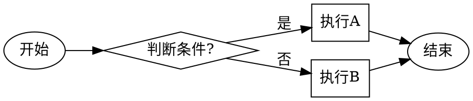
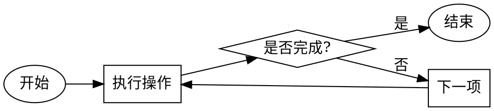
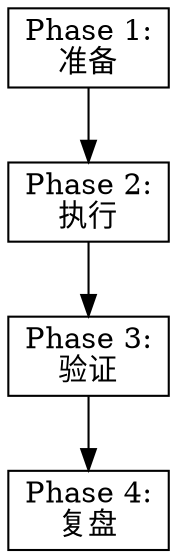

# Skill 创建模板集

本文件包含创建不同类型 Skill 的快速模板。

---

## 1. 简单工具型 Skill 模板（1.0）

适用场景：单一功能、个人使用、快速参考

```markdown
---
name: skill-name
description: Use when [具体触发条件]
version: 1.0.0
---

# Skill Name

> 核心理念一句话

---

## 触发场景

**使用**：
- ✅ [场景1]
- ✅ [场景2]

**不使用**：
- ❌ [反例1]

---

## 核心规则

### 规则1：[规则名称]

[具体说明]

### 规则2：[规则名称]

[具体说明]

---

## 检查清单

- [ ] [检查项1]
- [ ] [检查项2]
- [ ] [检查项3]

---

## 常见错误

### ❌ 错误1
**症状**：[如何识别]
**修复**：[如何避免]

---

## 版本历史

| 版本 | 日期 | 变更 |
|------|------|------|
| v1.0.0 | YYYY-MM-DD | 初始版本 |
```

---

## 2. 框架型 Skill 模板（2.0）

适用场景：多步骤流程、团队共享、结构化分析

```markdown
---
name: skill-name
description: Use when [具体触发条件]
version: 1.0.0
requires:
  - dependency-skill  # 可选
---

# Skill Name

> 核心理念一句话

---

## 🎯 技能定位

[一段话说明这个 Skill 解决什么问题]

**适用范围**：
- ✅ [适用1]
- ✅ [适用2]

**不适用**：
- ❌ [不适用1]

---

## 📋 完整流程

### Phase 1: [阶段名称]

**目标**：[这个阶段要达成什么]

**步骤**：
1. [步骤1]
2. [步骤2]

**检查清单**：
- [ ] [检查项1]
- [ ] [检查项2]

### Phase 2: [阶段名称]

**目标**：[这个阶段要达成什么]

**步骤**：
1. [步骤1]
2. [步骤2]

**检查清单**：
- [ ] [检查项1]
- [ ] [检查项2]

### Phase 3: [阶段名称]

[继续...]

---

## ⚠️ P0 强制规则

> 🚨 **STOP - 以下规则不可绕过**

1. **禁止**：[明确禁止的行为]
2. **必须**：[强制执行的行为]

---

## 🔍 常见错误

### 错误1：[错误描述]
**症状**：[如何识别]
**原因**：[为什么会发生]
**修复**：[如何避免]

### 错误2：[错误描述]
[继续...]

---

## 📚 参考资料

- [参考文档1](path/to/reference)
- [参考文档2](path/to/reference)

---

## 版本历史

| 版本 | 日期 | 变更类型 | 变更内容 |
|------|------|---------|---------|
| v1.0.0 | YYYY-MM-DD | 🎉 初始发布 | 基础功能实现 |
```

---

## 3. 工业化 Skill 模板（3.0）

适用场景：生产环境、质量保障、自适应优化

```markdown
---
name: skill-name
description: Use when [具体触发条件]
version: 1.0.0
requires:
  - meta-execution  # 通常需要质量保障
---

> 🚨 **STOP - 必须先加载 `meta-execution`**
>
> 本技能依赖 `meta-execution` 进行质量保障。
> 在执行任何操作前，必须先加载它。

# Skill Name

> 核心理念一句话

---

## 🎯 技能定位

[详细说明这个 Skill 的定位和价值]

**技能类型**：工业化技能（3.0）

**适用范围**：
- ✅ [适用1]
- ✅ [适用2]

**不适用**：
- ❌ [不适用1]

---

## 🚦 自适应激活机制

本 Skill 根据任务复杂度自动调整执行深度：

### 评分标准（C1-C7）

| 标准 | 描述 | 权重 |
|------|------|------|
| C1 | [标准1] | 高 |
| C2 | [标准2] | 高 |
| C3 | [标准3] | 中 |
| C4 | [标准4] | 中 |
| C5 | [标准5] | 低 |
| C6 | [标准6] | 低 |
| C7 | [标准7] | 低 |

### 触发规则

```
命中 ≥ 3 项（含≥1高权重） → 完整激活
命中 2 项                   → 标准模式
命中 1 项                   → 轻量模式
命中 0 项                   → 不激活
```

---

## 📊 五阶段执行流程

### Phase 0: 续接恢复

**何时执行**：会话中断后恢复

**操作**：
1. [步骤1]
2. [步骤2]

### Phase 1: 启动准备

**目标**：[...]

**P0 核心检查**：
- [ ] [检查项1]
- [ ] [检查项2]

**复杂任务扩展**（按需启用）：
- [ ] [扩展项1]
- [ ] [扩展项2]

### Phase 2: 执行过程

**目标**：[...]

**步骤**：
1. [步骤1]
2. [步骤2]

**错误处理**：
- 第1次失败：诊断 & 修复
- 第2次失败：换方法（⛔ 不重复相同操作）
- 第3次失败：资源组合
- 第10次后：升级给用户

### Phase 3: 交付审查

**三阶段审查**：

#### Stage 1: 规格符合
- [ ] 完整性：用户要求都实现了吗？
- [ ] 无遗漏：附加要求都完成了吗？
- [ ] 无越界：没做用户没要求的事？

#### Stage 2: 质量审查
- [ ] 正确性：逻辑正确吗？
- [ ] 清晰性：用户能看懂吗？
- [ ] 美观性：格式整齐吗？

#### Stage 3: 输出规范
- [ ] 格式符合标准
- [ ] 可直接使用
- [ ] 无明显错误

### Phase 4: 事后复盘

**目标**：持续改进

**记录**：
- 实际耗时 vs 预估
- 遇到的问题
- 改进建议

---

## ⚠️ Critical Rules

> 🚨 **不能绕过的禁止项**

- ❌ **禁止**：[禁止1]
- ❌ **禁止**：[禁止2]
- ✅ **必须**：[必须1]
- ✅ **必须**：[必须2]

---

## 🔍 常见错误与反模式

### 错误1：[错误描述]
**症状**：[如何识别]
**原因**：[根本原因]
**诊断**：[如何诊断]
**修复**：[如何修复]

[继续...]

---

## 📈 性能优化

### 优化1：[优化名称]

**场景**：[何时适用]
**方法**：[如何优化]
**效果**：[预期提升]

### 优化2：并行执行

**触发条件**：
- 有独立的子任务
- 子任务之间无依赖
- 并行能带来 > 2x 提升

**实现**：
```
tasks = []
for item in items:
    task = use_subagent(item)
    tasks.append(task)
# 等待全部完成
```

**降级策略**：
- 工具不可用 → 串行执行
- 超时 → 串行执行
- 错误率高 → 串行执行

---

## 📚 支持文件

| 文件 | 内容 |
|------|------|
| `references/详细说明.md` | 完整参考文档 |
| `scripts/工具.py` | 辅助脚本 |
| `templates/模板.md` | 模板文件 |

---

## 📊 效果度量

### 关键指标

| 指标 | 目标值 | 度量方法 |
|------|--------|---------|
| 执行时间 | < Xs | 记录实际耗时 |
| 错误率 | < Y% | 统计失败次数 |
| 用户满意度 | > Z% | 收集反馈 |

### 持续改进

- 每周回顾指标
- 识别瓶颈
- 优化关键路径

---

## 版本历史

| 版本 | 日期 | 变更类型 | 变更内容 | 破坏性变更 |
|------|------|---------|---------|-----------|
| v1.0.0 | YYYY-MM-DD | 🎉 初始发布 | 基础功能实现 | N/A |
```

---

## 4. Frontmatter 字段完整参考

```yaml
---
# === 必填字段 ===
name: skill-name                    # 技能名称（kebab-case）
description: Use when [触发条件]    # 触发条件（不要总结工作流！）

# === 推荐字段 ===
version: 1.0.0                      # 语义化版本号
requires:                           # 依赖的其他 Skill
  - dependency-skill-1
  - dependency-skill-2

# === 可选字段 ===
vibe: "简短的氛围描述"              # 技能的"感觉"
parallel_mode: true                 # 是否支持并行执行
deep_analysis: true                 # 是否执行深度分析

# === 废弃标记 ===
deprecated: true                    # 是否已废弃
deprecated_since: "2026-04-30"     # 废弃日期
deprecated_message: "请使用 new-skill 替代"
replacement: new-skill              # 替代方案
replacement_url: "https://..."     # 迁移指南链接
---
```

---

## 5. Description 字段最佳实践

### ✅ 优秀示例

```yaml
# 工具型
description: Use when tests have race conditions, timing dependencies, or pass/fail inconsistently

# 框架型
description: Use when executing implementation plans with independent tasks in the current session

# 工业化型
description: Use when implementing any feature or bugfix, before writing implementation code

# 领域特定
description: Use when using React Router and handling authentication redirects
```

### ❌ 错误示例

```yaml
# 错误1：总结了工作流
description: Use when creating skills - write test first, then skill, then verify

# 错误2：太抽象
description: For async testing

# 错误3：第一人称
description: I can help you with async tests

# 错误4：过于简短
description: Testing skill

# 错误5：太长（> 500 字符）
description: Use when you need to create a new skill and you want to follow the TDD methodology by first writing a baseline test to observe how the AI behaves without the skill, then writing the skill document to address those specific issues, and finally verifying that the skill works correctly by running tests with the skill loaded...
```

---

## 6. 常用流程图模板

### 决策流程



### 循环流程



### 多阶段流程



---

## 7. 检查清单模板

### 基础检查清单

```markdown
## 检查清单

- [ ] [检查项1]
- [ ] [检查项2]
- [ ] [检查项3]
```

### 分级检查清单

```markdown
## 检查清单

### 🔴 P0 必做核心

- [ ] [P0 检查项1]
- [ ] [P0 检查项2]

### 🟡 P1 推荐执行

- [ ] [P1 检查项1]
- [ ] [P1 检查项2]

### 🟢 P2 可选优化

- [ ] [P2 检查项1]
- [ ] [P2 检查项2]
```

### 阶段性检查清单

```markdown
## Phase 1 检查清单

- [ ] [检查项1]
- [ ] [检查项2]

## Phase 2 检查清单

- [ ] [检查项3]
- [ ] [检查项4]
```

---

## 8. 错误文档模板

### 简单版

```markdown
## 常见错误

### ❌ 错误1：[错误名称]
**症状**：[如何识别]
**修复**：[如何避免]

### ❌ 错误2：[错误名称]
**症状**：[如何识别]
**修复**：[如何避免]
```

### 完整版

```markdown
## 常见错误与反模式

### 错误1：[错误名称]

**症状**：
- [症状1]
- [症状2]

**原因**：
[为什么会发生这个错误]

**诊断方法**：
1. [如何确认是这个错误]
2. [排查步骤]

**修复方案**：
1. [解决步骤1]
2. [解决步骤2]

**预防措施**：
- [如何避免再次发生]
```

---

## 9. 版本历史模板

### 简单版

```markdown
## 版本历史

| 版本 | 日期 | 变更 |
|------|------|------|
| v1.0.0 | 2026-04-30 | 初始版本 |
```

### 详细版

```markdown
## 版本历史

| 版本 | 日期 | 变更类型 | 变更内容 | 破坏性变更 |
|------|------|---------|---------|-----------|
| v2.0.0 | 2026-05-01 | 🔴 重大变更 | 重构核心流程 | ✅ 是 |
| v1.2.0 | 2026-04-25 | 🟢 新功能 | 增加并行模式 | ❌ 否 |
| v1.1.1 | 2026-04-20 | 🔵 Bug修复 | 修复路径解析错误 | ❌ 否 |
| v1.1.0 | 2026-04-15 | 🟢 新功能 | 增加检查清单 | ❌ 否 |
| v1.0.0 | 2026-04-10 | 🎉 初始发布 | 基础功能实现 | N/A |
```

**变更类型图例**：
- 🎉 初始发布
- 🔴 重大变更（Major）
- 🟢 新功能（Minor）
- 🔵 Bug修复（Patch）
- 📝 文档更新
- ⚡ 性能优化
- 🔧 重构

---

## 使用说明

1. **选择合适的模板**：根据 Skill 的复杂度选择 1.0/2.0/3.0 模板
2. **填写所有占位符**：用实际内容替换 `[...]` 部分
3. **保持结构一致**：不要随意改变章节顺序
4. **适度裁剪**：删除不需要的可选章节
5. **遵循 TDD**：记住先测试，后编写！
